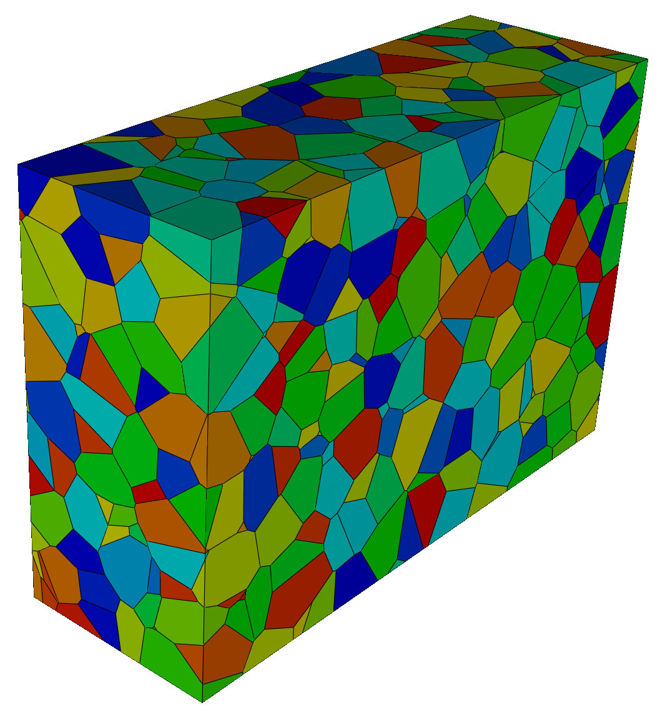
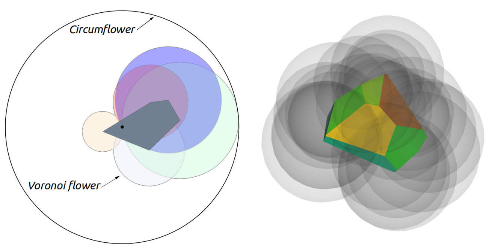
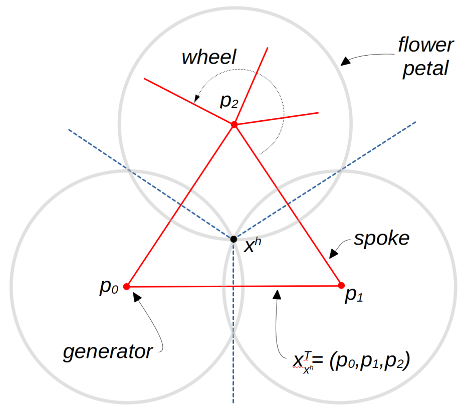
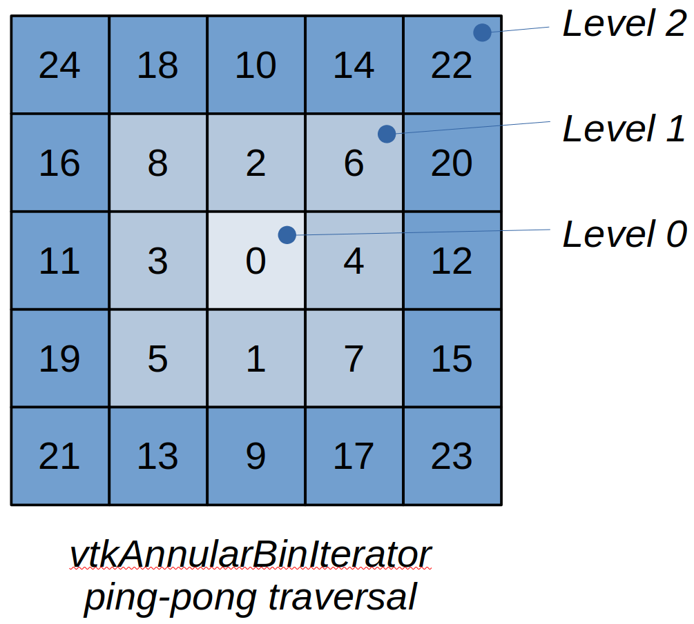
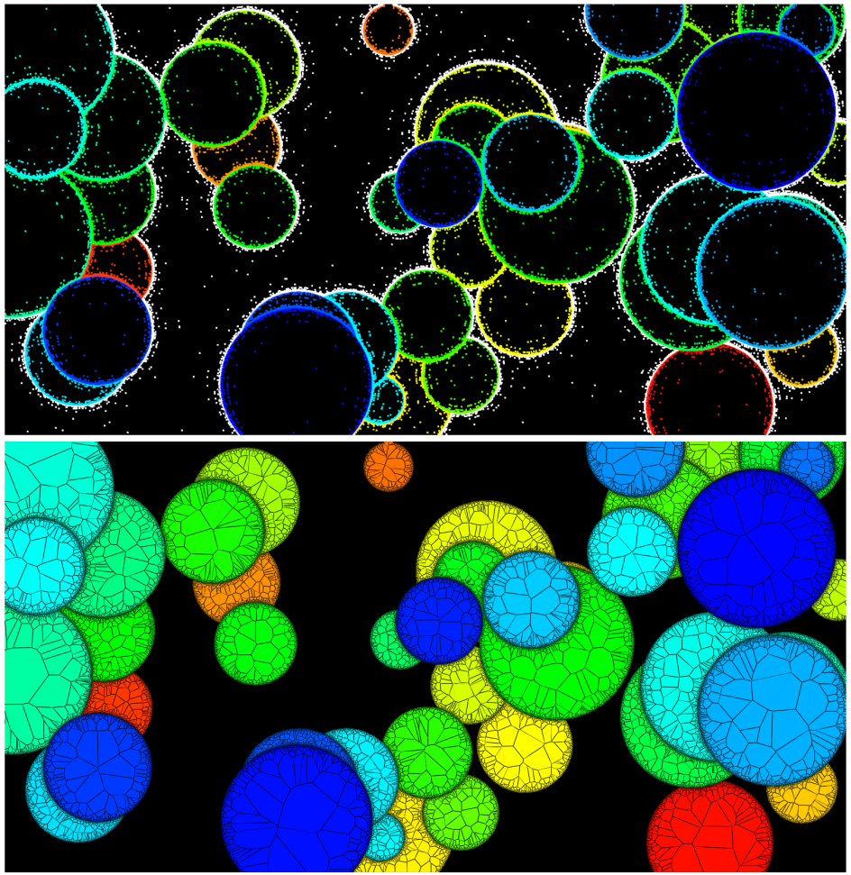
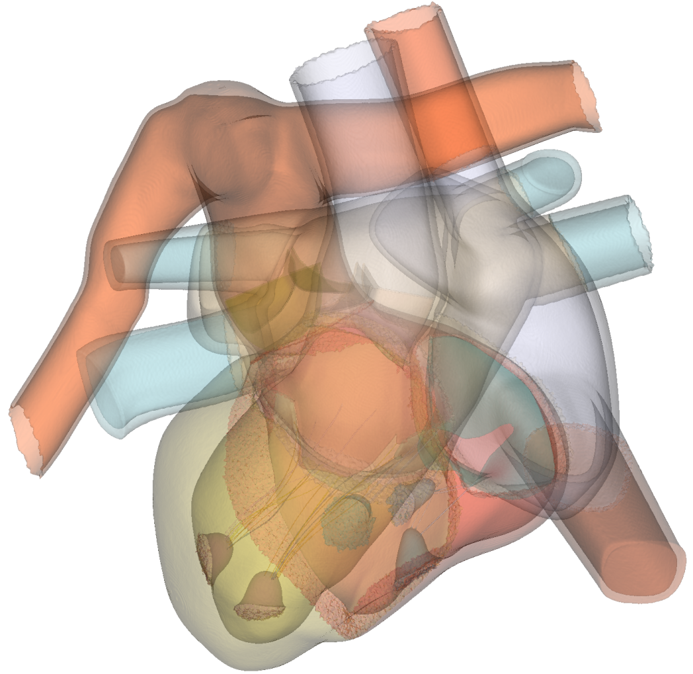

# Voronoi Framework
January 2026

## Contributors
This work originated with the article *A Parallel Meshless Voronoi Method for Generalized SurfaceNets* [1] . The article describes an algorithm that uses a Voronoi tessellation to generate surface nets contours for unstructured data. In order to implement this work, Voronoi algorithms were needed in VTK. This initial implementation eventually grew into a general computational framework for producing 2D/3D Voronoi tessellations and Delaunay triangulations. The authors hope that this framework will be beneficial to the many Voronoi-based algorithms used in the computational sciences.
- Will Schroeder
- David Thompson
- Spiros Tsalikis

## Introduction


Figure 1. Voronoi tessellation of a thousand random points.

The Voronoi tessellation, and its dual, the Delaunay triangulation, are some of the most important computational constructs in scientific computing (Figure 1). Used in a myriad of important applications including mesh generation, materials analysis, segmentation, path planning, mapping, computer graphics, and data analysis (to name just a few), the literature related to these areas is exhaustive, with the earliest usage found nearly 400 years ago.

Despite their importance to the computational sciences, VTK has provided minimal support for computing these constructs. While Delaunay 2D and 3D filters, based on variants of relatively simple sequential point insertion approaches have been available for some time, the limited speed of these algorithms, and their numerical fragility, offered only basic capabilities. And it is only with the release of this work that VTK-based Voronoi algorithms have become available.

To remedy this situation, we have developed a framework and associated algorithms for 2D and 3D Voronoi tessellations. The implementation uses a parallel, shared memory approach, meaning that the algorithm is relatively fast; and is compile-time (via templates) configurable, so that VTK's Voronoi algorithms can be tailored to the particular computational challenge at hand. Tools for generating the dual Delaunay triangulation, assessing and repairing topological issues, merging coincident points, and generating adjacency graphs, are just a few of the many additional capabilities provided by the framework. Several general-purpose VTK filters have also been implemented, which produce various output VTK types including convex polygons, polyhedra, polygonal and unstructured mesh datasets, and generalized surface nets (i.e., produced by a contouring operation on non-regular, segmented points).

This document is meant to be a high-level guide to the software composing VTK’s Voronoi framework and related filters. Refer to the tests, examples, and software for further details and information. The document begins by defining some basic Voronoi-related concepts, then describes VTK’s implementation of the associated framework, along with the various filters that use it. Finally, many supporting classes are available to generate and massage the Voronoi input point data—a brief summary of these classes is also provided. Throughout the presentation we adopt an informal communication style. For the more formally inclined, relevant technical papers describing this work can be found here [1,2,3].

## Concepts
**What is the Voronoi Tessellation?** Given an input set P of N (unique) points $p_i$ in D-dimensional space, the Voronoi tessellation partitions space into N convex regions each of which is the region of D-dimensional space nearest a generating point $p_i$. In 2D, the regions are convex polygons; in 3D convex polyhedra. We refer to the 2D Voronoi cells as “tiles”, and the 3D Voronoi cells as “hulls”. These cells are bounded by convex (D-1)-dimensional faces (i.e., edges in 2D and polygonal faces in 3D). These faces are formed by the intersection of the (D-1)-dimensional planes that separate the generating point $p_i$ from the set of nearby neighboring points $p_j$. Note that some Voronoi cells may be unbounded in extent, for example if the input data is two points with a single plane separating them. (Some Voronoi implementations use the concept of weights to control the generation of hulls. This capability is not supported at this time, we expect that this may be added in the future.)

**Generating the Voronoi Tessellation.** While a multitude of algorithms for generating the Voronoi tessellation have been developed, VTK uses a simple method motivated by what is referred to in the literature as “meshless” approaches. That is, each input point $p_i$ independently and in parallel generates its associated Voronoi cell. Consequently, immediately after generation the resulting cells are not connected (i.e., coincident points and faces are produced). However, the VTK Voronoi framework provides tools to extend the meshless method by providing several novel, topologically-based methods to merge coincident geometry, and ensure that the resulting tessellation is topologically valid (more on this later).  So while the resulting algorithm implements a fast, embarrassingly parallel approach motivated by meshless techniques, it has been significantly enhanced so that it can produce a fully formed, topologically valid mesh.

Each Voronoi cell is generated from an input point $p_i$, and the “nearby” neighboring points $p_j$. Quickly identifying the set of nearby points $p_j$ is the central challenge of creating fast meshless methods. Typically spatial locators such as octrees, or regular binning of space, are used to accelerate the proximal location search. Basically the algorithm proceeds by forming an initial Voronoi hull around the generating point $p_i$ (typically the initial hull is the bounding box surrounding the set of input points P), and then repeatedly clipping the hull with the half spaces formed at the center point of the line connecting $(p_i,p_j)$ and in the direction of ($p_i$ -> $p_j$). These clipping operations continue until the remaining points $p_j$ are far enough away that they can no longer intersect the Voronoi cell. In VTK, this termination condition is defined by use of the Voronoi circumflower (also referred to as the “radius of security” in the literature).


Figure 2. The Voronoi tile, flower and circumflower in 2D (left); the Voronoi hull and flower in 3D (right).

**The Voronoi Flower and Circumflower.** As Figure 2 shows, the Voronoi flower of the point $p_i$ is the collection of D-dimensional spheres (or petals) centered on the Voronoi hill/tile vertices $x_k$, with radius $||p_i - x_k||$, with a bounding sphere, or circumflower, defined as the maximal flower radius $2||p_i - x_k||_{max}$. These petals are simply the Delaunay circumspheres of the dual Delaunay simplexes which use $p_i$.

The hull/tile vertices $x_k$ are formed by the intersection of the planes separating $p_i$ and face neighboring points $p_j$. Usually D+1 planes intersect at a $x_k$ unless a numerical degeneracy exists (more on this later). For example, in 3D, the four clipping planes formed by the points $(p0,p1,p2,p3)$ intersect at $x_k$; in 2D the three lines formed by $(p0,p1,p2)$ intersect at $x_k$. The set of generating point ids $(p_i, p_j)$ which define the clipping planes meeting at a $x_k$ are called the topological coordinates of $x_k$. Note that the components of the topological coordinates are sorted in increasing order, so that in 3D the four components $(p0,p1,p2,p3)$ are ordered $p0 < p1 < p2 < p3$. This simplifies comparison operations such as equality checks.


Figure 3. Topological coordinates; wheels and spokes.

**Topological Coordinates.** Topological coordinates play a key role in VTK’s Voronoi framework (Figure 3). They are used in several ways to validate local mesh topology, and merge the coincident points $x_k$ (which are independently generated during the parallel construction of the hulls/tiles produced by each of the points in $(p_i,p_j)$. For example, to merge the duplicate points at $x_k$ in 3D, the four hulls generated from the four points $(p0,p1,p2,p3)$ each independently produce an $x_k$ with topological coordinate (p0,p1,p2,p3). By using a simple sorting operation, these topological coordinates (and associated $x_k$) can be gathered and assigned a unique point id, thereby merging the coincident $x_k$ and transforming a disconnected meshless Voronoi tessellation with duplicate vertices into a conformal, connected mesh. (Note: while geometric point merging could also be used to remove duplicates, because of numerical sensitivities, the points are typically not precisely geometrically coincident, meaning tolerances are needed—this is problematic.)

Topological coordinates are also used to evaluate local topology—a mesh degeneracy exists when the number of topologically coincident $x_k$ does not number (D+1). When combined with the Voronoi adjacency graph G, topological coordinates can be used to validate the resulting mesh, including correcting degenerate situations.

**The Adjacency Graph.** The adjacency graph G is a topological abstraction of the Voronoi tessellation. It is a graph that connects Voronoi cells (i.e., generating points $p_i$) with their face neighbors. It can be used for a variety of purposes including topological validation, and in applications such as path planning. In VTK, G consists of spokes (connections between $p_i$) and wheels, which are just the collection of spokes emanating from a particular $p_i$.

**Computing the Dual Delaunay Triangulation.** The Delaunay triangulation is the dual construct of the Voronoi tessellation. In other words, the Voronoi faces are transformed into edges (i.e. spokes) that connect neighboring point generators; and the Voronoi point generators become the vertices of Delaunay simplices. Remarkably, the topological coordinates enumerate the connectivity of the D-dimensional simplices that make up the Delaunay triangulation. Thus to generate the triangulation, each merged topological coordinate forms a simplex, with some added work necessary to properly order the components of the topological coordinate to produce a valid simplex. (Note that in degenerate cases, extra work is required to form a valid triangulation–more on this later.)

The Delaunay property—that the circumsphere of each simplex contains only the D+1 points of P defining the simplex—comes into play with the definition of the Voronoi flower. Each flower petal is a Delaunay sphere. In those cases where more than D+1 points lie on the sphere, a degenerate situation exists. This manifests in G as an incomplete subgraph; for example in 3D the components of topological coordinate $(p0,p1,p2,p3)$ are not connected with one another (i.e. one or more of the six spokes $p_i,p_j$ is missing).

**The Use of Region Labels.** A powerful feature of VTK’s Voronoi framework is the use of regions, or labels, associated with each point generator $p_i$. Regions are simply signed integer values that specify membership in a particular set. These are typically used to segment data, or represent membership in a particular data region. By convention, region ids $<0$ indicate that a point is “outside” and should not produce a Voronoi hull. However, outside points can serve as neighbors to “inside” points (region labels $>=0$) affecting the construction of the associated inside point cell. In this way, it is possible to carve away exterior regions, meaning that concave tessellations/triangulations can be created (Figure 5). Outside points also have the important effect of reducing the neighboring search space for $p_j$, speeding up the execution of the Voronoi algorithm.

Note also that points with ids <0 are considered outside. This special case of negative point ids is used to indicate Voronoi cell boundaries which are on the domain boundary, For example, the initial bounding box has six faces generated by the fictitious exterior points (-1, …, -6). Unless developing Voronoi algorithms, negative point ids are generally invisible to the user.

**Degeneracies and Validation.** In the discussion above, points are assumed to lie in general (i.e., random) position, i.e., points do not violate the Delaunay circumsphere criterion. Unfortunately in practice degenerate points are not unusual. For example, the set of corner points generated from image pixels or volume voxels are inherently degenerate. Much excellent work has been done to address such situations, particularly when generating Delaunay triangulations, including Shewchuk's adaptive precision predicates [4]. The VTK Voronoi framework does not use such approaches, rather it uses topological reasoning to validate, identify, and repair mesh issues due to numerical precision or degenerate configurations.

Numerical precision issues are related to degenerate or near degenerate situations. When generating the Voronoi tessellation, this manifests as tile edges (2D) or hull faces of near zero length (2D) or area (3D). Such tiny boundary entities can be deleted (or pruned), which in turn affects the Voronoi adjacency graph G. The adjacency graph should be symmetric, meaning that both the edge (p0,p1) and (p1,p0) should exist. If not, then the singular edge is deleted, which affects neighboring Voronoi cells.

Degeneracies may also manifest when the number of topological coordinates for a topologically coincident Voronoi cell vertex $(x_k) != (D+1)$. In such cases, a local analysis is performed to produce a valid Voronoi tessellation and/or Delaunay triangulation. This is of course slower as compared to assuming that points are in random/general position. In the VTK framework, a Validate flag is available to enable full topological analysis and repair. For many applications, this is never needed, thus the cost of validation can be omitted.

Besides performing topological analysis on G, other approaches are used to treat degeneracies. (A deep discussion of imprecision issues is coverted in the QHull documentation [6].) As articulated by QHull, two approaches are used: merging facets, and joggling (i.e., randomly perturbing or jittering) the input. In VTK, point jittering can be performed across all input points using filters like vtkJitterPoints. Alternatively, when producing Voronoi tiles and hulls (via the classes vtkVoronoiTile and vtkVoronoiHull), small facets are merged / discarded (based on a prune tolerance), and degeneracies may be treated by jittering the input.

## The Voronoi Framework
The framework described below is highly configurable based on templated algorithm classes. This enables the Voronoi classes to be extended for particular application needs. For example, using the framework it is possible to perform simple operations like computing/summing the volume of Voronoi cells, or performing local statistical analysis. However it is also possible to perform complex operations involving parallel compositing of Voronoi cell data (e.g., extract selected Voronoi cell faces, or perform local triangulation).  In the following section, we begin by providing a brief description of the framework classes, followed by a deeper look at extending the framework via templated compositing and classification classes.

**vtkVoronoiCore.h/.txx** defines and implements various high level utility classes for the Voronoi framework. Convenience typedefs and other definitions are also provided.

**vtkVoronoiCore2D.h/.txx** implements VTK’s Voronoi algorithm in 2D. Classes and typedefs specifically in support of 2D Voronoi operations are defined in the header file.

**vtkVoronoiCore3D.h/.txx** implements VTK’s Voronoi algorithm in 3D. Classes and typedefs specifically in support of 3D Voronoi operations are defined in the header file.

These core Voronoi classes can be extended to support particular computational needs. As mentioned previously, the core 2D and 3D classes use templates to perform two important operations. The first templated class, the compositor, performs operations necessary to support the parallel execution of the Voronoi algorithm. Depending on the particular application requirements, the compositor will accumulate data as each Voronoi cell is computed, and then combine this information into a final, global result after processing all the Voronoi cells. Typically this combining, or compositing process, uses parallel operations such as prefix sums, and parallel copying of accumulated local data from each thread into global output. The second templated class, the classifier, is used to capture the topological relationship of a Voronoi cell to its neighbors. By examining the edges (or spokes) that connect a generating point $p_i$ to each of its face neighbors $p_j$, it is possible to determine whether the associated face is on the domain boundary, separates the two neighboring cells via a region boundary, or captures other topological information relevant to a particular computational task.

Voronoi cells are computed via the `vtkVoronoiTile` (2D) and `vtkVoronoiHull` (3D) classes. Instances of these objects are used by the `vtkVoronoiCore2D` and `vtkVoronoiCore3D` classes, along with the spatial locator classes (more follows), to perform parallel construction of the Voronoi cells, with the compositor and classifier controlling what data is extracted and combined to produce a final output.

**vtkVoronoiHull.** The `vtkVoronoiHull` class constructs a convex polyhedron from repeated clipping operations. Starting with an initial 3D bounding box surrounding a generator point $p_i$, neighboring points $p_j$ define clipping planes at the halfway location between the generator and neighboring points, with the plane normal in the direction of $p_i$ -> $p_j$. The class also constructs the Voronoi flower and circumflower, which can be used to quickly cull points which do not intersect the hull.

**vtkVoronoiTile.**  The `vtkVoronoiTile` class constructs a convex polygon from repeated clipping operations. Starting with an initial 2D bounding box surrounding a generator point $p_i$, neighboring points $p_j$ define clipping lines at the halfway location between the generator and neighboring points, with the line normal in the direction of $p_i$  -> $p_j$. The class also constructs the Voronoi flower and circumflower, which can be used to quickly cull points which do not intersect the tile.


Figure 4.  The iterators access locator bins in an increasing distance, ping-pong traversal style, beginning at the generator point. In 3D, the ping-pong order is across opposite faces, as well as within faces.

In addition to the classes listed above, the vtkStaticPointLocator and vtkStaticPointLocator2D locator classes play a critical role in the Voronoi algorithms. These objects perform local point searches around each generator point $p_i$, identifying nearby points in an expanding search (which ends only when the circumflower criterion is satisfied or the search space is exhausted). This process is facilitated by iterators which grow the search space using a ping-pong traversal from the generating point outward.

**vtkAnnularBinIterator.** The `vtkAnnularBinIterator` is used to iterate over `vtkStaticPointLocator2D` bins (or buckets) surrounding a generating point $p_i$. The iteration proceeds in such a way that locator bins are returned in increasing distance from $p_i$. As each bin is visited, the points contained in the bin (if any) are used by the Voronoi algorithm to perform clips on a `vtkVoronoiTile` instance.


Figure 5. The 2D Voronoi tessellation of random segmented circles. The top image shows the input points including points marked exterior/outside. This enables concave tessellations to be produced.

**vtkShellBinIterator.**  The `vtkShellBinIterator` is used to iterate over `vtkStaticPointLocator` bins (or buckets) surrounding a generating point $p_i$. The iteration proceeds in such a way that locator bins are returned in increasing distance from $p_i$. As each bin is visited, the points contained in the bin (if any) are used by the Voronoi algorithm to perform clips on a `vtkVoronoiHull` instance.
Conceptually, VTK’s core Voronoi algorithm is simple and embarrassingly parallel. The details of the compositor and classifier, the neighborhood search process, and the cell construction process, add significant implementation complexity. To better understand how these components work together, reviewing the simple `TestVoronoiCore2D.cxx` and `TestVoronoiCore3D.cxx` tests may help. Of course, these framework classes have been instantiated for use by several VTK filters. Reviewing these filters is another good way to learn more about VTK’s Voronoi framework.

## VTK Filters
Initially three VTK filters have been added as part of the Voronoi framework. More will be added in the future, but these offer basic capabilities applicable to many computational challenges.

**vtkVoronoi2D.** The `vtkVoronoi2D` filter can generate a 2D Voronoi tessellation, Delaunay triangulation, or both, from an input set of points (represented by any `vtkPointSet` or subclass). In addition, the filter has built-in debug features so that the Voronoi flower can be produced for a particular input point (I.e., point of interest).

**vtkVoronoi3D.** The `vtkVoronoi3D` filter can generate either a 3D Voronoi tessellation (`vtkPolyhedron` cells) or a Delaunay tetrahedralization (`vtkTetra` cells) contained in an output unstructured grid. The filter can also be configured to produce an output `vtkPolyData` consisting of one of an adjacency graph, a boundary surface mesh, a polygonal complex (all Voronoi faces are produced), or a surface net (if region labels are provided).


Figure 6. Generalized surface net produced from 14,649,149 points and 21 segmented regions of a human heart.

**vtkGeneralizedSurfaceNets3D.** Surface Nets is a contouring algorithm that is typically used to extract the surfaces of labeled regions; e.g., the surface of objects defined by image segmentation labels [5]. The traditional surface nets algorithm was designed to operate on structured image/volume data. VTK’s Voronoi framework enables the generation of surface nets for unstructured point data. (The algorithm simply generates a Voronoi tessellation, and extracts the shared faces between Voronoi cells whose generating points exist in different regions–Figure 6).

## Supporting Filters
Several supporting filters exist in VTK to prepare input for the Voronoi framework and filters. These can be used to adjust point distributions through a randomization process, add new points to the input, and convert scalar fields into input point sets,

**vtkThresholdScalars.** This filter converts a continuous scalar field into discrete, labeled regions (essentially a primitive segmentation algorithm). This is useful for selecting and tessellating portions of an input dataset—for example, a sampling of points can be labeled/segmented and provided to the Voronoi filters for processing. While the `vtkThresholdScalars` filter operates on any input `vtkDataSet` type, because the Voronoi framework operates on input `vtkPointSet` (i.e., explicit point representations), point sampling or other transformation may be required to produce input suitable for the Voronoi classes.

**vtkJitterPoints.** The `vtkJitterPoints` filter randomly perturbs point positions. It operates on any input of type `vtkPointSet`, modifying only the point coordinate data. It can be used to evaluate the numerical sensitivity of Voronoi-based algorithms, as well as improving the performance of Voronoi algorithms by removing degeneracies.

**vtkFillPointCloud.** This filter adds points to an existing point cloud (i.e., an instance of a `vtkPointSet`), placing points in regions where no input points exist. The fill operation preserves the input points (and any region labels if available), and adds new points with a specified background label.  `vtkFillPointCloud` can be used to improve the performance of the Voronoi algorithms by reducing the search space for neighboring points. By specifying a background region id (i.e., region label < 0), the added points serve to reduce the search space, and carve out exterior regions–-as a result the Voronoi/Delaunay filters can produce concave tessellations.

**vtkLabeledImagePointSampler.** This filter generates points from a labeled/segmented input 3D volume or 2D x-y image. This can be used to reduce the overall size of the data, and/or convert data (from a segmented image to a sampled `vtkPointSet`) for filters such as vtkVoronoi2D/3D or vtkGeneralizedSurfaceNets3D, which require an input point cloud. The required filter input image data is an integral region id point data array (i.e., segmentation labels).

**vtkProbeFilter.** This filter has long existed in VTK yet offers interesting capabilities in support of the Voronoi framework. By probing with a point cloud (or other type of `vtkPointSet`), it is possible to selectively tessellate probed regions of data.

## Usage: Building and Testing
This section describes how to begin using the Voronoi framework in VTK. Begin by building VTK on your platform as described in the build instructions. Pay particular attention to the following CMake variables:

`CMAKE_BUILD_TYPE` - to obtain maximum performance, use “Release”. Since the Voronoi framework is templated, the optimizations resulting from this build type make a significant impact on performance.
`VTK_SMP_IMPLEMENTATION_TYPE` - to enable threading, ensure that this is set to a value other than “Sequential”. TBB and STDTHREAD are typically recommended, with TBB (due to load balancing) typically providing the best performance.
`VTK_WRAP_PYTHON` - Enable Python wrapping since many of the tests and examples are written in Python.

Note that if the SMP implementation type is set to TBB, then you may have to set the CMake variable TBB_DIR. Similarly, wrapping Python requires that `Python3_INCLUDE_DIR` and `Python3_LIBRARY` are set appropriately. Typically, the values of these CMake variables are discovered during the CMake configure process; however non-typical system configurations may require some assistance to resolve.

Once CMake is properly configured, and the build process completes, there are many tests and examples that can be run. We recommend starting with the tests found in `VTK/Filters/Meshing/Testing/Python/TestVoronoi*.py` and `VTK/Filters/Meshing/Testing/Cxx/TestVoronoi*.cxx`. To run the Python tests, simply invoke:

```
$ cd VTK/Filters/Meshing/Testing/Python/
$ ~/VTK/build/bin/vtkpython TestVoronoi3D2.py
```

assuming that VTK has been built in the `~/VTK/build/` directory. To run a C++ test, invoke:

```
$ cd ~/VTK/build/
$ ./bin/vtkFiltersMeshingCxxTests TestVoronoiCore3D
```

The environment variable `VTK_SMP_MAX_THREADS` can be used to limit the number of computing threads used during execution. For example, export `VTK_SMP_MAX_THREADS=48` limits the number of threads to 48. However, depending on your computing platform, and the size of the problem, this number of threads may not be used. Sequential processing can be enforced by setting `VTK_SMP_MAX_THREADS` to 1.

Additional help is available from the VTK Discourse list.

## Voronoi Framework Template Parameters
For advanced users and developers, understanding the template parameters which are used to instantiate VTK’s Voronoi framework is essential. The template parameters are the two classes `TCompositor` and `TClassifier`, which define how each thread extracts data, and how the spokes (and other topological information) is determined. For example, the templated class `vtkVoronoiCore3D` is defined as follows:

```
template <class TCompositor, class TClassifier=vtkVoronoiClassifier3D>
class vtkVoronoiCore3D
{ … };
```

The compositor is used to extract specific information as each Voronoi hull is generated; accumulating this information in thread local storage, and then eventually compositing the data into a global, final output. The classifier is used to extract topological information relative to face-neighboring hulls; in particular this takes the form of spoke classifications; which can be used to extract various, selected portions of the resulting Voronoi mesh (e.g., the polygons forming a surface net). For example, a compositor can be defined which simply computes each Voronoi hull’s volume, and then computes a total volume during the final compositing process. Obviously other information such as statistics relative to the topological and geometric features of generated hulls can be accumulated and composited. As shown, a default class (vtkVoronoiClassifier3D) is provided to classify the Voronoi spokes which enables the extraction of mesh boundaries (including segmented region boundaries). It is possible to extend the classification process so as to capture topological neighborhood information (e.g., the “strength” of connection to neighboring hulls).

For further information, we recommend studying the vtkVoronoiCore, vtkVoronoiCore2D, and vtkVoronoiCore3D classes found in the VTK/Filters/Meshing directory.

## Future Work
With the addition of the configurable Voronoi framework, significant potential exists to add new Voronoi-based computational and visualization algorithms to VTK. For example, two filters will be added in the near future: a centroidal Voronoi tessellation (CVT), and segmentation meshing filter. The first will be used to create optimal tessellations corresponding to an ideal distribution of generating points; the second filter will be used to Delaunay mesh segmented regions. We also plan to expand this work to provide mesh generation capabilities for various simulation and modeling applications.

## References
[1] W. Schroeder, D. Thompson, S. Tsalikis. "A Parallel Meshless Voronoi Method for Generalized SurfaceNets." IEEE Transactions on Visualization and Computer Graphics. (In preparation.)

[2] C. H. Rycroft. “Voro++: A three-dimensional voronoi cell library in c++.” Chaos: An Interdisciplinary Journal of Nonlinear Science, vol. 19, no. 4, p. 041111, 10 2009.

[3] J. Lu, E. A. Lazar, and C. H. Rycroft. “An extension to voro++ for multithreaded computation of voronoi cells.” Computer Physics Communications, vol. 291, p. 108832, 2023.

[4] J. R. Shewchuk, “Triangle: Engineering a 2d quality mesh generator and delaunay triangulator.” in Applied Computational Geometry Towards Geometric Engineering, M. C. Lin and D. Manocha, Eds. Berlin, Heidelberg: Springer Berlin Heidelberg, 1996, pp. 203–222.

[5] W. Schroeder, S. Tsalikis, M. Halle, and S. Frisken. “A high-performance surfacenets discrete isocontouring algorithm.” 2024. [Online]. Available: https://doi.org/10.48550/arXiv.2401.14906.

[6] Imprecision in QHull. http://www.qhull.org/html/qh-impre.htm [Online]
