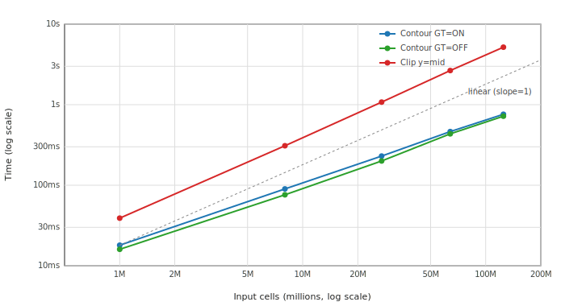

# vtkPolyhedron Contour, Clip, and IsInside Algorithms

## Overview

This document describes the algorithms used by `vtkPolyhedron` for contouring
(isosurface extraction), clipping, and inside/outside classification.

**Reference:**
> J. López, A. Esteban, J. Hernández, P. Gómez, R. Zamora, C. Zanzi, F. Faura,
> "A new isosurface extraction method on arbitrary grids",
> Journal of Computational Physics, Volume 444, 2021, 110579.
> https://doi.org/10.1016/j.jcp.2021.110579

The open-source isoap library implementing this algorithm is available at:
https://doi.org/10.17632/4rcf98s74c.1

## Face Winding Requirement

All algorithms below require that polyhedron faces have **outward-pointing
normals**: vertices must be ordered counter-clockwise when viewed from outside
the cell (right-hand rule). This requirement is documented in `vtkPolyhedron.h`.

The solid-angle `IsInside()` depends on this for correct sign of the winding
number. The López contour/clip algorithm depends on this for correct
"key face" assignment (outside→inside edge transitions).

## IsInside: Solid Angle Summation

`vtkPolyhedron::IsInside()` determines whether a query point lies inside or
outside the polyhedron using the winding number computed via solid angle
summation.

### Algorithm

A closed surface subtends exactly **4π steradians** when viewed from any
interior point, and **0 steradians** from any exterior point. This is the 3D
generalization of the 2D winding number.

```
total_solid_angle = 0
for each face:
    triangulate face (fan from minimum-index vertex)
    for each triangle (a, b, c):
        total_solid_angle += solid_angle(a, b, c, query_point)

if |total_solid_angle| ≈ 4π → INSIDE
if |total_solid_angle| ≈ 0  → OUTSIDE
```

The solid angle of a triangle is computed using the Van Oosterom–Strackee
formula:

```
tan(Ω/2) = det(ra, rb, rc) / (|ra||rb||rc| + |ra|(rb·rc) + |rb|(ra·rc) + |rc|(ra·rb))
```

where `ra = a − x`, etc.

A near-surface tolerance provides an early-out for points very close to faces,
treating them as inside. This avoids numerical ambiguity at the boundary.

### Comparison with Previous Implementation

| Aspect | Old (Random Ray Casting) | New (Solid Angle) |
|--------|--------------------------|-------------------|
| Determinism | Non-deterministic | Deterministic |
| Edge cases | Ray hits vertex → retry | No special cases |
| Iterations | Up to 10 with voting | Single pass |
| Winding dependence | None (counts intersections) | Requires outward normals |


## Contour: López Polygon-Tracing Algorithm

`vtkPolyhedron::Contour()` extracts isosurface polygons using the López
polygon-tracing method, implemented in `vtkPolyhedronContour`.

### Algorithm

1. **Classify vertices** as inside (scalar > isoValue) or outside.

2. **Find iso-vertices** on edges that cross the isosurface. Each iso-vertex
   lies on an edge shared by exactly two faces. One face sees the edge as
   outside→inside (the **key face**); the other sees inside→outside.

3. **Trace iso-polygons** by walking through key faces:
   ```
   start at any unvisited iso-vertex
   repeat:
       face = current.KeyFace
       next = next iso-vertex on this face (circular order)
   until next == start
   ```

   The next-iso-vertex-on-key-face rule produces closed polygons
   that form the isosurface contour without any post-processing.

4. **Interpolate** positions linearly along the crossing edges.

### Key Insight

Each iso-vertex has a "key face" (where the edge goes outside→inside in face
traversal order). Tracing through key faces to the next iso-vertex
automatically produces closed contour polygons. No triangulation, no edge
merging, no fragment assembly.

### Comparison with Previous Implementation

| Aspect | Old (Triangulate-and-Merge) | New (López) |
|--------|---------------------------|-------------|
| Face handling | Triangulates all faces | Works on original faces |
| Internal edges | Created then removed | Never created |
| Post-processing | Complex MergeTriFacePolygons | None |
| Winding dependence | None | Requires outward normals |
| Code complexity | ~800 lines, 20+ functions | ~550 lines, 1 class |


## Clip

`vtkPolyhedron::Clip()` reuses the contour infrastructure with an additional
face-building step:

1. Steps 1–3 from Contour (classify, find iso-vertices, trace iso-polygons).
2. **Build clipped faces**: for each original face, walk vertices keeping those
   on the retained side, inserting iso-vertices at cut edges.
3. **Add cap faces**: the traced iso-polygons become cap faces that close the
   clipped polyhedron (with reversed winding for `insideOut`).
4. **Output** as a polyhedron face stream.

## Implementation Structure

| File | Description |
|------|-------------|
| `vtkPolyhedron.h/.cxx` | Cell class; delegates to `vtkPolyhedronContour` |
| `vtkPolyhedronContour.h/.cxx` | López algorithm: per-cell and bulk threaded API |
| `vtkContour3DLinearGrid.cxx` | Threaded contour: polyhedron handling in fast + general paths |
| `vtkTableBasedClipDataSet.cxx` | Threaded clip: polyhedron handling with face stream output |

## Centroid: Divergence Theorem

`vtkPolyhedron::GetCentroid()` computes the volume and centroid simultaneously
using the divergence theorem. Each face is fan-triangulated from its first
vertex. Each triangle (v0, v1, v2) forms a signed tetrahedron with the origin
whose volume is `v0 . (v1 x v2) / 6`. The centroid is the volume-weighted
average of tet centroids `(v0 + v1 + v2) / 4`.

This replaces the previous pyramid-decomposition approach that required an
arbitrary apex point, per-face normal/area computation via `vtkPolygon`, and
face centroid calculations.

## Computational Complexity

Let E = total edge count across all faces (equivalently, sum of face vertex
counts). For typical polyhedra E is O(F·k) where F = faces and k = average
vertices per face.

| Operation | Old | New |
|-----------|-----|-----|
| Contour | O(F·k²) — per-face triangle merge with linear-search edge ordering | O(E) — single-pass polygon tracing |
| Clip | O(F·k²) — same contour + face rebuild | O(E) — trace + linear face walk |
| IsInside | O(F) with up to 10 non-deterministic retries | O(E) single deterministic pass |
| GetCentroid | O(E) with per-face vtkPolygon dispatch | O(E) direct arithmetic |

The old contour/clip bottleneck was `OrderEdgePolygon`, which performs a linear
scan plus `std::vector::erase` (both O(n)) for each edge in a face's contour
fragment, giving O(k²) per face. The new López algorithm visits each iso-vertex
exactly once during polygon tracing.

The constant-factor improvement is also significant: the old implementation
creates ~20 intermediate data structures (vectors of edge vectors, edge-face
maps, point-edge multimaps, edge count maps) and converts between
representations multiple times. The new implementation uses one hash map for
edge-to-iso-vertex lookup and traces directly.
## Bulk Threaded API

`vtkPolyhedronContour` provides a per-cell static API for integration with
VTK's threaded contour and clip filters. The API takes the cell's
`vtkCellArray` face stream and a `vtkDataArray` scalar field directly, without
instantiating `vtkPolyhedron` objects.

### Contour: single-call per-cell helper

Contour extraction uses a single-pass cell helper, `ContourCell`. The helper
runs the full López trace for one polyhedron and reports the intersected
edges as `(globalPtId0, globalPtId1, t)` tuples plus a per-polygon
vertex-count array. Iso-vertex deduplication is performed by the calling
filter through its shared edge locator (`vtkStaticEdgeLocatorTemplate`); the
helper does not write final iso-vertex coordinates. There is no separate
count phase because `vtkContour3DLinearGrid` does not prefix-sum polyhedron
cell sizes before running the trace: the point merger absorbs per-cell
output into thread-local buffers, and the fast path emits triangle vertex
coordinates directly.

### Clip: two-pass Count/Emit

Clip uses the classic two-pass pattern required to deduplicate iso-vertices
through a shared edge locator:

1. **Count pass** (parallel): Each thread calls `CountClip` per cell to
   determine output sizes and to record the set of intersected edges.

2. **Prefix sum + edge locator build** (serial): Global offsets are computed
   from per-cell counts, and the collected edge list is fed into a shared
   `vtkStaticEdgeLocatorTemplate` that assigns unique iso-vertex IDs.

3. **Emit pass** (parallel): Each thread calls `EmitClip` per cell, writing
   geometry into pre-allocated output arrays at the computed offsets.

Both Count and Emit internally call the same `RunLopezTrace` function. The
trace is O(E). Running it twice per cell (once for Count, once for Emit) is
the canonical price paid for the two-pass parallel structure, and the
thread-local trace workspace keeps the constant factor low.

### Shared Core

A single `RunLopezTrace` function in an anonymous namespace implements the
López algorithm on raw arrays. The per-cell `Execute` path and the bulk
entry points (`ContourCell`, `CountClip`, `EmitClip`) all dispatch through
this function. There is one algorithm implementation, not two.

### API Summary

All entry points take the cell's `vtkCellArray` face stream and a
`vtkDataArray` scalar directly, and report intersected edges as
`(globalPtId0, globalPtId1, t)` tuples for downstream deduplication via a
shared edge locator.

**Contour — single-call helper.** Used by `vtkContour3DLinearGrid` in both
fast and general paths.

```
static void ContourCell(numPointIds, pointIds, polyhedronFaces, scalars,
    isoValue, generateTriangles,
    polygonsSize, intersectedEdges);
```

`polygonsSize` is a per-output-polygon vertex count (3 for each triangle
when `generateTriangles=true`); `intersectedEdges` holds the edge tuples in
polygon traversal order so the caller can build polygon connectivity by
looking up each edge's deduplicated iso-vertex ID.

**Clip — two-pass Count/Emit.** Used by `vtkTableBasedClipDataSet`. Output
point IDs are written directly (combining the kept-point `pointMap` lookup
with the iso-vertex `numberOfKeptPoints + edgeId` offset) so the caller can
copy the resulting cell arrays into pre-reserved global offsets without a
second remapping pass.

```
static void CountClip(numPointIds, pointIds, polyhedronFaces, scalars,
    isoValue, insideOut,
    &numOutputCells, &numOutputCellConnectivity,
    &numOutputFaces, &numOutputFacesConnectivity,
    intersectedEdges);

static void EmitClip(numPointIds, pointIds, polyhedronFaces, scalars,
    isoValue, insideOut, pointMap, numberOfKeptPoints, edgeLocator,
    outputCells, outputFaces);
```

The clip Count/Emit functions return edge endpoint pairs and interpolation
weights rather than interpolated point data, so the calling filter can perform
point data interpolation externally in bulk, matching the pattern used by
existing VTK threaded filters.

### Filter Integration

| Filter | Path | How polyhedra are handled |
|--------|------|--------------------------|
| `vtkContourFilter` | Delegates to `vtkContour3DLinearGrid` | Threaded fast + general paths |
| `vtkContour3DLinearGrid` (fast) | `ContourCells::operator()` | `ContourCell` with `generateTriangles=true`; edge tuples deduplicated via the shared `vtkStaticEdgeLocatorTemplate` and triangle vertex coords emitted into thread-local point buffers |
| `vtkContour3DLinearGrid` (general) | `ExtractEdges::operator()` | `ContourCell` producing edge tuples `(v0, v1, t)` for the shared `vtkStaticEdgeLocatorTemplate`; per-polygon vertex counts retained for the post-merge polygon emit pass when `GenerateTriangles=OFF` |
| `vtkTableBasedClipDataSet` | `ExtractCells` (integrated with MC batch pipeline) | Polyhedra flow through the same batch / prefix-sum / extract pipeline as other cell types, using the cell-array `CountClip` (classify phase) and `EmitClip` (extract phase). Fast-kept/discarded cells use sentinel case values; intersected cells go through Count/Emit with the shared edge locator. |
| `vtkClipDataSet` | Per-cell fallback | `vtkPolyhedron::Clip` -> `Execute` -> `RunLopezTrace` |

### Batch Data Extension (vtkTableBasedClipDataSet)

The `vtkTableBasedClipDataSet` batch framework uses `TableBasedCellBatchData`
with an `operator+=` that accumulates per-batch counts across threads via
prefix sum. Polyhedron support required adding two new fields:

- `PolyhedronFacesOffset`: total face connectivity entries (vertices per face)
- `PolyhedronFaceLocsOffset`: total face count entries (number of faces per cell)

These accumulate through the existing `operator+=` / `BuildOffsetsAndGetGlobalSum`
machinery alongside `CellsOffset`, `CellsConnectivityOffset`, and
`CentroidsOffset`. The prefix sum converts per-batch counts into global offsets
that `ExtractCells` uses to write face data at the correct positions.

Polyhedron cells reuse the existing sentinel case values that
`vtkMarchingCellsClipCases.h` defines for all cell types: `KEPT_CELL_CASE`
(fast-kept, all vertices on the retained side) and `DISCARDED_CELL_CASE`
(fast-discarded, no vertices on the retained side). Cells that actually
intersect the isosurface get the case value `1`, indicating "handled by the
Count/Emit path." These values are distinct from the 8-bit MC case indices
used by other cell types, so there is no collision.

## Performance

Benchmarks on an 8-core machine with polyhedron grids (hexahedral cells stored
as `VTK_POLYHEDRON`), comparing the threaded `vtkContour3DLinearGrid` and
`vtkTableBasedClipDataSet` against the legacy per-cell `vtkContourGrid` and
`vtkClipDataSet` paths:

**Contour** (`vtkContour3DLinearGrid` with MergePoints + InterpolateAttributes
vs `vtkContourGrid`):

| Grid size | Legacy (ms) | Threaded (ms) | Speedup |
|-----------|------------|--------------|---------|
| 30³ (27K) | 68 | 15 | 4.4x |
| 50³ (125K) | 194 | 63 | 3.1x |
| 70³ (343K) | 400 | 183 | 2.2x |

**Clip** (`vtkTableBasedClipDataSet` vs `vtkClipDataSet`):

| Grid size | Legacy (ms) | Threaded (ms) | Speedup |
|-----------|------------|--------------|---------|
| 20³ (8K) | 36 | 14 | 2.6x |
| 30³ (27K) | 67 | 32 | 2.1x |

See the production CFD mesh section below for detailed clip benchmarks across
multiple cut scenarios on a 2.88M-cell mesh.

Key optimizations: direct grid array access when points and scalars are
`double` (eliminates per-cell copy), `thread_local` trace workspace (reuses
hash maps and vectors across cells within each thread), and a compact-remap
path that keeps the per-cell scratch buffers dense in local indices.

When input points are not `double`, a compact-remap path is used: a per-thread
`globalToLocal` map remaps cell point IDs to dense local indices `0..nCellPts-1`,
the face stream is remapped to local indices, and `cellPts`/`cellScalars` buffers
of size `nCellPts` are filled. Performance is comparable to the `double` path
(68 ms vs 61 ms on the 2.88M-cell drone mesh).

### Production CFD Mesh (drone_results.cgns)

A production all-polyhedra CFD mesh with **2.88M VTK_POLYHEDRON cells** and
6.5M points (CGNS NFACE/NGON format). Benchmarks run on an 8-core Linux
workstation. Each reported number is the median wall-time across 5
consecutive `Update()` calls, after one warmup `Update()`, measured with
`time.perf_counter()` around the filter `Update()`. Baseline is the
released ParaView 6.1.0 binary (pvpython) on the same Linux machine,
against the same mesh and pipeline.

**Contour** — PRES isocontour at value=0:

The speedup comes from two independent contributions:

| Change | Baseline | Result | Speedup |
|--------|----------|--------|---------|
| López algorithm alone (serial `vtkContourGrid`) | ~10,300 ms (PV 6.1.0 baseline) | ~1,300 ms (Linux, warning-free) | **~8x** |
| Threading + C3DLG infrastructure | ~1,300 ms (serial López) | **59 ms** (C3DLG, 8 cores, no normals) | **~22x** |
| **Combined vs PV 6.1.0 baseline (no normals)** | ~10,300 ms | **59 ms** | **~175x** |
| **Combined vs PV 6.1.0 baseline (ComputeNormals=ON)** | ~10,400 ms | **73 ms** | **~143x** |

The old algorithm emits hundreds of topology-defect warnings per run via
mutex-serialized `vtkGenericWarningMacro`, which dominates wall-clock time
in a warning-heavy environment. The López algorithm handles the same defective
cells silently and correctly, so warning overhead is not a factor in the new
path.

| Path | Time (ms) | Output cells | Output size |
|------|-----------|--------------|-------------|
| ParaView 6.1.0 baseline, GT=ON, ComputeNormals=OFF | 10,309 | 438K triangles | 18.6 MB |
| ParaView 6.1.0 baseline, GT=OFF, ComputeNormals=OFF | 11,247 | 438K triangles | 18.6 MB |
| `vtkContour3DLinearGrid` GT=ON, ComputeNormals=OFF | **59** | 439K triangles | 18.6 MB |
| `vtkContour3DLinearGrid` GT=ON, ComputeNormals=ON | **73** | 439K triangles | 18.6 MB |
| `vtkContour3DLinearGrid` GT=OFF, ComputeNormals=OFF | **51** | 175K polygons | **12.6 MB** |
| `vtkContour3DLinearGrid` GT=OFF, ComputeNormals=ON | **55** | 175K polygons | **12.6 MB** |

ComputeNormals=ON adds only a few milliseconds (cell-normal compute and
point-normal averaging at merged vertices). The previous orientation pass via
`vtkOrientPolyData` is no longer needed because the López trace produces
consistently oriented iso-polygons directly, so polygon-mode contours no
longer pay an orientation cost. Linux, 8-core workstation, 2.88M-cell drone
mesh, PRES=0.

The GenerateTriangles=OFF path uses `ContourCell(generateTriangles=false)` to
extract polygon connectivity directly, bypassing fan-triangulation. Output
polygons carry correct cell data and point normals. The 175K polygon count vs
439K triangle count reflects that polyhedron iso-polygons are typically quads
or pentagons that would otherwise each be split into 2-3 triangles. The 6 MB
output size reduction (32%) is meaningful in time-series workflows. With the
orientation pass removed, GT=OFF is now strictly faster than GT=ON on this
mesh (51 ms vs 59 ms with no normals).

**Contour memory** — on Windows, the old `vtkContourGrid` working set peaks at
**3,310 MB** during processing vs a 2,703 MB baseline — a ~600 MB transient
spike from per-cell `vtkPolyhedron` intermediate allocations. The new C3DLG
path uses thread-local workspace that stabilizes at high-water mark after the
first few cells and shows no measurable spike.

**Clip** — plane y=0 (half-domain, ~50% cells kept), 5 reps, median:

| Path | Time (ms) | Output |
|------|-----------|--------|
| ParaView 6.1.0 baseline (`vtkClipDataSet` fallback for polyhedra) | 4,822 | 1,450,017 cells, 3,406,651 pts |
| `vtkTableBasedClipDataSet` with first-class López polyhedron support | **194** | 1,449,631 cells, 3,283,329 pts |

This is a **~25x speedup** at the user-visible Clip filter level. The
dominant contribution is that `vtkTableBasedClipDataSet` now handles
polyhedra directly via `CountClip`/`EmitClip` instead of falling back to a
contour-based clip pipeline; the unified inside/outside classification
(shared with `ContourCell`) avoids redundant per-cell vertex tagging across
the count and emit passes.

Edge-locator sizing is bounded by the set of edges actually intersected by
the plane (O(N_intersected × avg_edges_per_cell)) rather than the full input
edge set, which keeps small-cut scenarios fast and avoids the half-domain
slowdown seen in earlier clip implementations that pre-populated the locator
with all input points.

**Summary**: on this all-polyhedra CFD mesh, `vtkContour3DLinearGrid` is
**~22x faster** than serial López contour and **~175x faster** than the
ParaView 6.1.0 baseline (no normals). With ComputeNormals=ON the speedup vs
baseline is ~143x. `vtkTableBasedClipDataSet` with first-class polyhedron
support is **~25x faster** than the ParaView 6.1.0 baseline on the y=0 plane
cut. All numbers are PRES=0 contour and y=0 plane clip on the 2.88M-cell
drone mesh, 8-core Linux workstation, comparing to ParaView 6.1.0 (released)
on the same hardware.

### Synthetic All-Polyhedra Scaling Study

To characterize how wall-time scales with mesh size, we run the same
contour and clip operations on synthetic all-polyhedra grids generated by
`vtkCellTypeSource(VTK_POLYHEDRON)` with a wavelet scalar field
(`vtkRTAnalyticSource` formula evaluated analytically on the polyhedral
mesh's points; no auxiliary image or resampler). Isovalue is the field
midrange; clip plane is `y = D/2` (half-domain).

**Timing methodology**: each reported number is the arithmetic mean of 5
consecutive `Update()` calls on the same filter instance, after a single
warmup `Update()` to absorb any one-time scheduling or allocation costs.
Each `Update()` runs the full filter end-to-end (`RequestData()` to
output ready). Wall-time is measured with `time.perf_counter()` around
the `Update()` call. Input dataset construction, scalar field evaluation,
and any pipeline plumbing happen once before timing starts and are not
included in the reported numbers.

This is a problem-size scaling study at fixed thread count: every row uses
the same Linux 8-core workstation as the drone benchmark, with VTK SMP
running at its default thread count (8). Threads are not varied. The
timings therefore reflect how total work grows with mesh size on a fixed
machine, not parallel efficiency (strong scaling) or per-thread efficiency
under proportional growth (weak scaling).



| Grid | Input cells | Output cells (contour) | Contour GT=ON (ms) | Contour GT=OFF (ms) | Clip y=mid (ms) |
|------|------------:|------------------------:|-------------------:|--------------------:|----------------:|
| 100³ | 1.0 M       | 167 K                   | 18                 | 16                  | 39              |
| 200³ | 8.0 M       | 673 K                   | 90                 | 76                  | 309             |
| 300³ | 27.0 M      | 1.52 M                  | 230                | 200                 | 1,077           |
| 400³ | 64.0 M      | 2.69 M                  | 463                | 435                 | 2,656           |
| 500³ | 125.0 M     | 4.21 M                  | 761                | 720                 | 5,180           |

The plot above is log-log; the dashed line is slope-1 (linear) for
reference. Contour wall-time scales sublinearly with input cells: 125x
input growth from 100³ to 500³ produces only ~42x growth in contour
time. The reason is dimensional: contour input is volumetric (`O(D³)`)
but contour output is the iso-surface, which is `O(D²)`. The output-bounded
portion of the algorithm therefore grows more slowly than total input
work. Clip output is also volumetric (a fraction of the input mesh), so
its cost scales close to linearly with input.

The drone production benchmark (2.88 M cells, 51-73 ms contour, 194 ms
clip) sits comfortably within the linear regime of this scaling curve.
The 125 M-cell point demonstrates that the algorithm contours nine-figure
polyhedral meshes in under one second on commodity hardware.

### GenerateTriangles=OFF for Linear Cells

`vtkContour3DLinearGrid` now handles `GenerateTriangles=OFF` for all supported
linear cell types (VTK_HEXAHEDRON, VTK_TETRA, VTK_WEDGE, VTK_PYRAMID) via a
`vtkPolygonBuilder` post-process on the merged triangle output. Previously,
`vtkContourFilter` with `GenerateTriangles=OFF` fell back to `vtkContourGrid`
(serial, per-cell) for all these types. Now the full threaded C3DLG pipeline
handles them end-to-end — `vtkContourGrid` is no longer involved.

The polygon builder groups merged triangles by input cell ID and uses edge
interior/boundary counting to reconstruct the iso-polygon boundary. This
reproduces what `vtkContourHelper` does inside `vtkContourGrid`, but applied
once on the globally merged output rather than per cell.

Benchmarks on a 30×30×30 synthetic grid (`vtkCellTypeSource`),
`vtkContour3DLinearGrid` vs `vtkContourGrid`:

| Cell type | CGrid ON (ms) | C3DLG ON (ms) | CGrid OFF (ms) | C3DLG OFF (ms) | OFF speedup |
|-----------|--------------|--------------|----------------|----------------|-------------|
| HEX (27K cells) | 12.8 | 1.7 | 6.0 | 3.4 | **1.8x** |
| TET (324K cells) | 26.0 | 2.1 | 40.0 | 17.0 | **2.4x** |
| WEDGE (54K cells) | 5.5 | 0.8 | 9.5 | 4.7 | **2.0x** |
| PYRAMID (162K cells) | 15.1 | 2.0 | 24.6 | 13.1 | **1.9x** |

`vtkContourFilter` now unconditionally routes all supported cell types to
`vtkContour3DLinearGrid` regardless of `GenerateTriangles`, passing the flag
through via `SetGenerateTriangles()`. `vtkContourGrid` is no longer used for
any mesh that `CanFullyProcessDataObject` accepts.

## Limitations

These are inherent to vertex-based isosurface extraction, shared with the
previous implementation:

- **Vertex-based sampling**: only vertex scalar values are considered
- **Linear interpolation**: iso-vertex position is linearly interpolated
- **One crossing per edge**: an edge can have at most one iso-vertex
- **Manifold assumption**: each edge must be shared by exactly two faces
- **Outward normals required**: faces must be wound with outward-pointing normals

## Normal Computation (`ComputeNormals=ON`)

When `ComputeNormals=ON`, `vtkContour3DLinearGrid` computes per-cell normals
on the contour output and averages them at each merged vertex:

1. **Cell normals** — `vtkTriangle::ComputeNormal` for triangles,
   `vtkPolygon::ComputeNormal` over all polygon vertices for native
   iso-polygons (`GenerateTriangles=OFF`).
2. **Point normals** — unweighted average of adjacent cell normals at each
   merged vertex, normalized. Identical to `vtkPolyDataNormals::GetPointNormals`.

This relies on the López trace and the marching case tables producing
consistently wound output for the cell types they handle. Polyhedron
generation paths that may emit reordered faces (e.g. the wedge decomposition
in `vtkUnstructuredGrid`) are corrected at the source so the contour output
is consistent without a post-pass orientation step.


## Future Work

### Face-Based Algorithm and GPU Execution

The current implementation operates cell-by-cell: for each polyhedron,
it unpacks the face stream, builds a global-to-local index map, copies
coordinates and scalars into a compact local buffer, and runs the López
trace. This is efficient on CPU but does not map well to GPU execution,
where irregular per-cell control flow and per-cell memory allocation are
costly.

We have developed a face-based reformulation of the López algorithm that
eliminates all cell-level bookkeeping and exposes the computation as two
purely data-parallel phases.

#### Key Insight

In a face-based mesh (the native format of CFD solvers such as Fluent and
OpenFOAM), each internal face stores its vertex list wound CCW for the
owner cell (c0), and a neighbour cell ID (c1). The López polygon trace,
which walks cell faces in CCW order to assign key vertices, is equivalent
to walking each face once for each of its two cells — forward for c0,
reversed for c1. The owner/neighbour direction flag encodes all the
cell-level orientation information López needs; no cell topology is
accessed during the algorithm.

#### Algorithm

**Phase 1** runs in parallel over all (face, cell) pairs. For each face,
walk its vertices in the CCW direction for the given cell. Collect crossing
edges in walk order to form the IPVINT list. For each key edge (a crossing
where the walk steps outside-to-inside), pair it with the immediately
preceding crossing edge in the IPVINT list (circular). Emit that pair as a
polygon graph edge attributed to the cell. For faces with four crossing
edges (saddle configurations), this rule resolves the topological ambiguity
identically to the original López Algorithm 3.

**Phase 2** runs in parallel over cells. Each cell accumulates a small
polygon adjacency graph from Phase 1. Since every iso-vertex has degree two
in this graph, the polygon is recovered by following the chain until it
closes. Multiple disconnected cycles produce separate output polygons.

This reformulation has been verified to produce bit-for-bit identical
polygon vertex sets and cyclic orderings to the original López algorithm
across 300 test cases including random scalar fields and deliberately
constructed ambiguous face configurations.

Phase 1 maps directly to a GPU compute shader or Viskores worklet: one
thread per (face, cell) pair, no shared state during emission. Phase 2
maps to one thread per intersected cell executing a short sequential loop
of 3 to 20 steps. The compact local index remap required by the current
CPU implementation disappears entirely since the algorithm operates on
global vertex IDs throughout.

#### Implications for vtkPolyhedronContour

The face-based reformulation could replace the current `ContourCell` and
`CountClip`/`EmitClip` implementations, removing the per-cell scratch
buffers (`ScratchGlobalToLocal`, `ScratchFaceStream`, `ScratchCoords`,
`ScratchScalars`) and the global-to-local hash map build. The public API
surface would change to accept a face list with owner/neighbour
assignments rather than a per-cell face stream. For meshes already stored
in face-based format no preprocessing would be required.

### Native Face-Based Storage for Polyhedral Datasets

The current VTK unstructured grid stores polyhedra via a face stream
embedded in `vtkCellArray`: for each polyhedron cell, the face stream
encodes face count, then for each face its vertex count followed by global
vertex IDs. This format requires unpacking the full face stream to access
any single face, and does not directly expose the owner/neighbour
relationship between adjacent cells.

A more efficient representation for polyhedral CFD data would store faces
as first-class entities:

- **Face list**: one entry per unique face, storing vertex IDs wound CCW
  for the owner cell, the owner cell ID (c0), and the neighbour cell ID
  (c1, or -1 for boundary faces).
- **Cell-to-face map**: for each cell, the list of face IDs that bound it.
  Used only for cell reconstruction — not needed during isosurface
  extraction.

This representation matches the native format of OpenFOAM
(`owner`/`neighbour`/`faces` files) and Fluent polyhedral meshes. It
enables the face-based isosurface algorithm to operate directly on the
stored data without any intermediate unpacking or reformatting.

#### Cell Reconstruction from Faces

When cell-level output is required (e.g. for clip operations that output
a clipped unstructured grid rather than a surface), cells can be
reconstructed from the face list using the cell-to-face map. Each output
polyhedron is described by collecting its bounding face IDs, remapping
face vertices to local indices, and writing the VTK face stream. This
reconstruction pass is a straightforward map over cells and is independent
of the isosurface extraction.

For some in-situ and GPU use cases, cell reconstruction may not be needed
at all: the isosurface output is a surface mesh of polygons, which is
already in the correct form for GPU rendering without any cell-level
structure.

### GPU Execution Paths

Three implementation strategies are being considered for GPU execution of
the face-based algorithm:

**Viskores worklets** provide GPU portability across CUDA, HIP, and
OpenMP backends. Phase 1 maps to a scatter worklet over faces; Phase 2
maps to a small gather worklet over cells. Viskores does not currently
have a native face-based mesh representation and would require either a
new dataset type or a face-array adapter.

**Direct CUDA kernels** give full control and are appropriate for use
cases committed to NVIDIA hardware. The face-based algorithm's two-phase
structure maps directly: a CUDA kernel over (face, cell) pairs for Phase
1, a prefix sum for output sizing, and a second kernel over cells for
Phase 2. This path requires no new VTK data structures but is not
portable to AMD or Intel GPUs.

**Compute shaders** (GLSL/WGSL via VTK's WebGPU or OpenGL backends) are
the most forward-looking option for browser-delivered rendering where
output is streamed to a JavaScript frontend. Phase 1 is a compute pass
with atomic append or two-pass count/emit; Phase 2 can be skipped by
rendering polygon edges directly from the Phase 1 output and
fan-triangulating from a centroid.

For CFD meshes dominated by polyhedra with smooth scalar fields, ambiguous
faces (four crossing edges on a single face) are rare. The IPVINT
circular-previous rule handles them correctly in all cases without any
geometric test, so all three GPU paths can use the same branch-free
per-face kernel.
