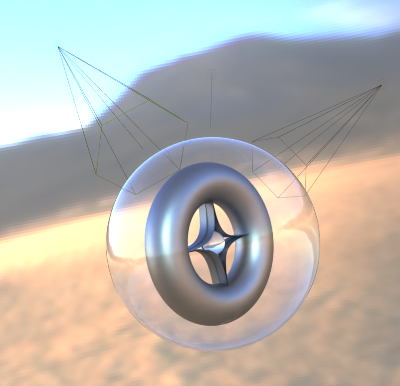

## Add vtkLightWidget to path-traced environments

The `vtkRenderingRayTracing` module now supports rendering and interaction with the `vtkLightWidget`
to be able to interactively place and modify lights in the view.

