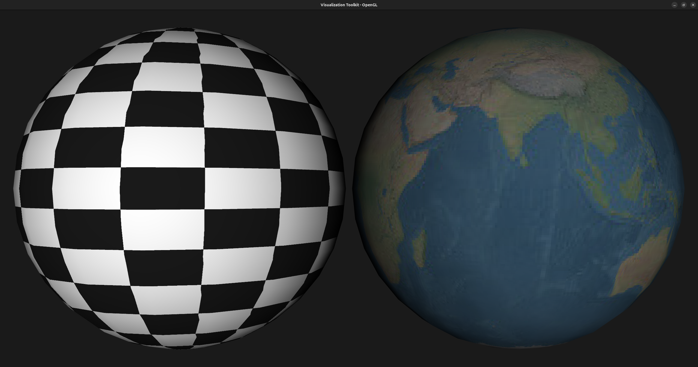
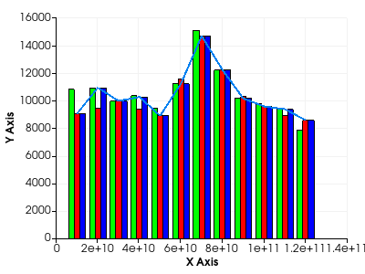
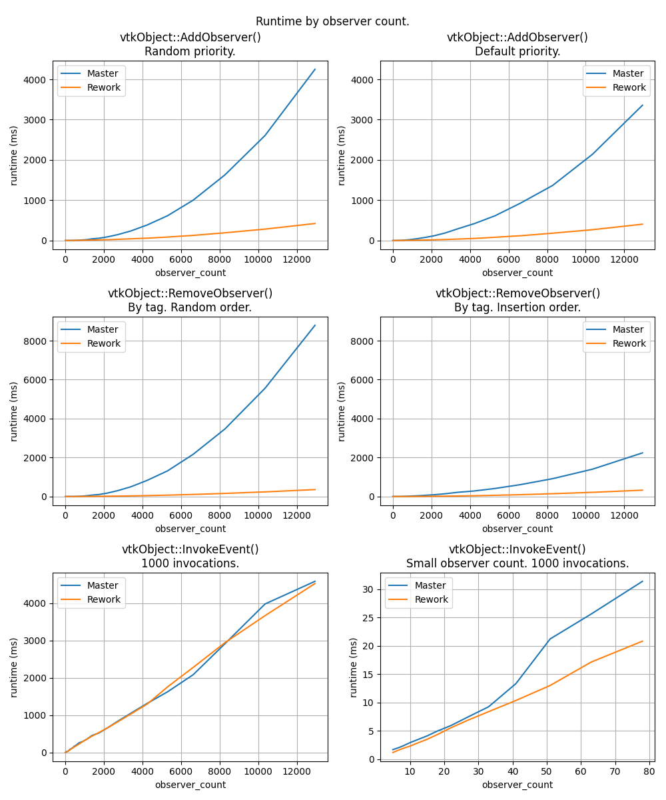

# VTK 9.6 Release Notes

Changes made since VTK 9.5.2 include the following.

---
<!-- mtoc-start -->

* [New Features](#new-features)
  * [Annotation](#annotation)
  * [Build](#build)
  * [Core](#core)
  * [DataModel](#datamodel)
  * [Filters](#filters)
  * [I/O](#io)
  * [Interaction](#interaction)
  * [Python](#python)
  * [Rendering](#rendering)
  * [WebAssembly](#webassembly)
* [Changes](#changes)
  * [Build](#build-1)
  * [Core](#core-1)
  * [DataModel](#datamodel-1)
  * [Filters](#filters-1)
  * [I/O](#io-1)
  * [Rendering](#rendering-1)
  * [WebAssembly](#webassembly-1)
* [Fixes/improvements](#fixesimprovements)
  * [Accelerators](#accelerators)
  * [Annotation](#annotation-1)
  * [Charts](#charts)
  * [Core](#core-2)
  * [DataModel](#datamodel-2)
  * [Filters](#filters-2)
  * [I/O](#io-2)
  * [Interaction](#interaction-1)
  * [Python](#python-1)
  * [Java](#java)
  * [Rendering](#rendering-2)
  * [WebAssembly](#webassembly-2)
* [Deprecations/Removals](#deprecationsremovals)
* [Updates](#updates)

<!-- mtoc-end -->
---

## New Features

### Annotation

* **Scalar Bar Vertical Title Separation**
The `VerticalTitleSeparation` property in a scalar bar controls the distance between the title of the scalar bar and the color bar itself when the title is oriented vertically. This property is now applied even for horizontal scalar bars, ensuring consistent spacing regardless of orientation.

| Vertical Scalar Bar | Horizontal Scalar Bar |
|:-------------------:|:---------------------:|
|  |  |

### Build

* **Add CMake Option for HDF5 Thread Safety**
You can now enable HDF5 thread safety in the build by setting the new `VTK_USE_HDF5_THREAD_SAFETY` CMake option. This allows VTK to use HDF5 in multi-threaded environments, enabling you to load multiple HDF5 files concurrently.
* **Add PLATFORM_TARGET argument for vtkModule CMake APIs**
The `vtk_module_build` function now supports a `PLATFORM_TARGET` keyword argument. This allows you to specify a target that provides platform-specific compile and link flags. These flags will be automatically propagated to consumers of VTK modules, ensuring consistent builds across different platforms.

### Core

* **Add vtkPExecutableRunner**
`VTK` now has a `vtkPExecutableRunner` class that handles command line execution in multi-process cases. As `vtkExecutableRunner` runs commands on every process, this class controls on which process the command will be executed.

### DataModel

* **Add an abstract vtkCartesianGrid**
A new abstract class, `vtkCartesianGrid`, adds a layer of abstraction to both `vtkImageData` and `vtkRectilinearGrid`. It is now possible to use a common API for both classes.
([Author notes](9.6/add-vtkCartesianGrid.md))
* **Introduce the implicit vtkStridedArray: a strided view on a buffer**
The `vtkStridedArray` is a `vtkImplicitArray` providing a strided view on an existing memory buffer. If you work with a multi-dimensional buffer of data, you can create a `vtkStridedArray` to manipulate a single dimension (which can itself be a scalar or a vector) of this buffer through the classical `vtkDataArray` API.
([Author notes](9.6/strided-array.md))
* **vtkCellArray: Support offsets/connectivity as vtkDataArray**
The `vtkCellArray` used to be able to support storing connectivity and offsets that are either `vtkTypedInt32Array` or `vtkTypedInt64Array`. It now supports storing the connectivity and offsets as any `vtkDataArray` subclass using `vtkCellArray::SetData(vtkDataArray* offsets, vtkDataArray* conn)`.
Additionally, `vtkAffineArray` has become a first-class citizen in `vtkCellArray` to support creating a cell array with cells of constant size without needing to store the offsets explicitly, thereby saving memory.
([Author notes](9.6/vtkCellArray-generic-vtkDataArray.md))
* **vtkDataArray: Add GetMemorySpace and GetDeviceVoidPointer API**
`vtkDataArray` now includes two new methods: `GetMemorySpace()` and `GetDeviceVoidPointer()`. These methods provide enhanced support for device memory management, allowing users to query the memory space of the data array and obtain a device pointer for direct access, if available.
**Automatic tolerance in `vtkCellValidator`**
An automatic per-polyhedron tolerance is now provided as an option to the validator. It will choose a tolerance that is a fraction of the shortest non-zero edge length to prevent unwanted coincident vertices.

### Filters

* **Add ONNX inference**
ONNX Inference is now available via `vtkONNXInference`. This new filter allows inference of AI models using the ONNX framework in VTK. This filter is added in a new module dedicated to ONNX and AI-related computation. The filter takes as input a vector of parameters and outputs cell or point data of any dimension. It can also use the cell data or the point data as the input of the model.
([Author notes](9.6/add-onnx-support.md))
* **Add source: Lissajous point cloud**
The `vtkLissajousPointCloud` algorithm is a source that creates a poly-data object with vertex cells on or near a periodic, parameterized, three-dimensional curve.
* **Add vtkPointsMatchingTransformFilter**
`VTK` now has `vtkPointsMatchingTransformFilter`, a new way to transform a `vtkPointSet` by specifying 4 pairs of points in space and deducing the uniquely defined affine transform.
* **Create HyperTreeGridRedistribute filter**
A new filter for redistributing HyperTrees from a HTG has been created, so trees are balanced equally between partitions.
* **Introduce vtkRedistributeDataSetToSubCommFilter**
This new data distribution filter aggregates data onto specified MPI ranks for writing to disk or other processing tasks. To specify the ranks where data should be aggregated, you must provide an MPI sub-communicator configured for only the target MPI processes.
* **VTK can now segment a scalar field into discrete intervals**
VTK can now generate discrete segmentation labels from a continuous scalar field. The newly added filter `vtkThresholdScalars` segments the scalars through the definition of one or more `[min,max,labelId)` scalar intervals.

### I/O

* **Adding stream support to various readers**
`vtkResourceStream` can now be encapsulated into a `std::streambuf` using `vtkResourceStream::ToStreambuf()`.
Stream support has been added to: `vtkSTLReader`, `vtkPTSReader`, `vtkHDFReader` (prefer memory stream), `vtkCityGMLReader` (prefer memory stream), `vtkOpenVDBReader`, `vtkDICOMImageReader`,  `vtk3DSImporter`, and `vtkOBJImporter`.
([Author notes](9.6/add-stream-support.md))
* **Add support for cell array and point array with the same name in Conduit**
VTK now correctly converts a data object with two arrays that have the same name to a Conduit node. The two arrays (points and cells) are renamed to `arrayName_vertex` and `arrayName_element` in the Conduit node only when a name conflict occurs.
* **Add support for LAS offsets in vtkPDALReader**
`vtkPDALReader` can now read X/Y/Z offset values from PDAL metadata. This improves handling of georeferenced LAS/LAZ files by applying the proper offset without manual configuration.
* **New notation and precision support in vtkDelimitedTextWriter**
Added support for specifying numeric notation (e.g., scientific, fixed) and precision when writing floating-point data.
* **New USD exporter added**
`vtkUSDExporter` is a new class that exports VTK scenes to Universal Scene Description (USD) files (.usd, .usda (ASCII), and .usdc (binary)). It is part of a new `vtk::IOUSD` module that depends on OpenUSD.
([Author notes](9.6/add-usd-exporter.md))
* **Polyhedrons support in VTKHDF**
Polyhedron cells are specified as part of the VTKHDF specification, and `vtkHDFReader` now supports Polyhedron cells as part of the Unstructured Grid type, through new VTKHDF fields.
* **vtkImageReader2 now supports reading vtkResourceStream**
`vtkImageReader2::Get/SetStream` methods have been added and implemented in `vtkPNGReader`, `vtkTGAReader`, `vtkJPEGReader`, `vtkHDRReader`, and `vtkBMPReader`.
* **vtkIOSSReader: Add GroupAlphabeticVectorFieldComponents**
`vtkIOSSReader` can now control whether to group alphabetic vector field components, such as `vel_x`, `vel_y`, `vel_z`, into a single vector field, such as `vel`, which was automatically done before.
* **Setting for increased ASCII precision**
The Legacy and XML writers now provide a method named `SetPrecision()` to specify the number of decimal digits of precision to use when writing floating-point data-arrays in ASCII format. The default is 11 (which matches the previous behavior and keeps file size low for medium-sized data) but it can now be adjusted to 17 (so that double-precision floating-point values are exactly preserved).

### Interaction

* **Add a new widget to handle a configurable number of lines**
`VTK` now has a `vtkMultiLineWidget` class that handles a configurable number of `vtkLineWidget2` instances. The representation of this class is a `vtkMultiLineRepresentation`, which displays the corresponding number of `vtkLineRepresentation`.
* **Add behavior to clear one axis or all axes selection in vtkChartParallelCoordinates**
For parallel coordinates charts, data selection can now be interactively cleared:
* Left-clicking without dragging on an axis clears the selected axis.
* Left-clicking within the chart area outside of the axes area clears the entire chart selection.

* **Add missing selection mode behavior in parallel coordinates chart**
The parallel coordinates chart supports new keyboard shortcuts for different selection modes:
* Press `Ctrl` while selecting to add to the current selection.
* Press `Shift` while selecting to subtract from the current selection.
* Press `Ctrl+Shift` while selecting to toggle compared to the current selection.
([Author notes](9.6/add-missing-selection-behavior-parallel-coordinates-view.md))

### Python

* **Add numpy support for composite arrays**
You can now use VTK composite arrays with numpy functionality just like non-composite arrays. All numpy-related algorithms previously accessible via `algs` (alias for `numpy_interface.algorithms`) are now accessible directly with their numpy counterparts (e.g., `np.mean`). Slicing is now also available.
([Author notes](9.6/add-numpy-support-for-composite-arrays.md))
* **Add Python Free threading support**
VTK's Python wrappers now support Python's free-threading mode (PEP 703), available since Python 3.13+.

### Rendering

* **Add composite data texturing**
`vtkCompositePolyDataMapper` can now handle textures for composite data. Textures can be assigned with a block flat index, thus texturing each block differently.

* **Add rotation parameters to OpenGL skybox**
OpenGL Skybox now supports rotations, which are also applied to the image-based lighting in the polydata mapper. A rotation matrix `EnvironmentRotationMatrix` is now available in the `vtkRenderer`.
* **Add support for coloring with LUT in vtkOpenGLSurfaceProbeVolumeMapper**
Allows `vtkOpenGLSurfaceProbeVolumeMapper` to use a lookup table for coloring. If a lookup table is provided, a texture map is used for coloring in order to map a 1-component image through the lookup table when probing.
* **Add texturing support in WebGPU**
VTK's WebGPU backend now supports texture mapping for 3D models. You can turn on `InterpolateScalarsBeforeMapping` on the polydata mapper or apply a texture to the actor.
* **Add Wayland support for the vtkEGLRenderWindow**
`vtkEGLRenderWindow` supports native Wayland as a backend, which will be able to perform onscreen and offscreen rendering. To use it, you need to set the new option `VTK_USE_WAYLAND_OPENGL` to `ON`.
* **Extend vtkProperty with a new line join setting**
You can now set the kind of join geometry to use between contiguous line segments of a polyline with the `vtkProperty::SetLineJoin(LineJoinType)` method. The possible values are `RoundCapRoundJoin`, `MiterJoin`, and `NoJoin`.

### WebAssembly

* **Add JavaScript wrappers with Emscripten**
Use the automated wrapping infrastructure of the `VTK::WrappingTools` module to generate JavaScript bindings of the VTK C++ classes by enabling the `VTK_WRAP_JAVASCRIPT` CMake option.
([Author notes](9.6/add-javascript-wrapper-frontend.md))
* **Add serialization support for custom modules**
VTK now provides a new CMake function `vtk_module_add_serdes_wasm_package`. You can use it to enable (de)serialization for external VTK modules in WASM.
* **Add WebAssembly interface for standalone applications**
You can now develop remote WASM or standalone WASM applications using the `vtkWebAssembly.wasm` binary. The `VTK::WebAssembly` and `VTK::WebAssemblyAsync` now build a `vtkWebAssembly[Async].wasm` and associated `.mjs` file that provide `vtkRemoteSession` and `vtkStandaloneSession` JavaScript classes.
* **Limit number of WASM threads**
Enable the possibility to limit the number of WASM threads available for the SMP STDThread backend. A parameter, `VTK_WEBASSEMBLY_SMP_THREAD_POOL_SIZE`, is introduced.

## Changes

### Build

* **Compilers: Increase Minimum Microsoft Visual Studio Version to 2019**
Due to the addition of the `scnlib` library and an update in the `expat` library, the minimum supported version of Microsoft Visual Studio (MSVC) for building VTK has been increased to MSVC 2019.
* **VTK_LEGACY_REMOVE is now ON by default**
In anticipation of the deprecation of `VTK_LEGACY_REMOVE` and its replacement by `VTK_DEPRECATED_IN_*`, `VTK_LEGACY_REMOVE` is now `ON` by default.

### Core

* **Add functions to import/export object manager state from/to byte arrays**
VTK's `vtkObjectManager` class now includes methods to import (`ImportFromBytes`) and export (`ExportToBytes`) its state using byte arrays.
* **Remove <iostream> from core header file**
Including `<iostream>` in a header induces global constructors into every downstream translation unit. It has been removed from the `vtkIOStream` header.
* **Replace unsafe C from/to string functions**
VTK has been using a set of either unsafe or slow C/C++ functions to convert numbers to strings or vice versa (e.g., `atof`, `sprintf`, `sscanf`). These have been replaced by safer/faster alternatives provided by `scnlib`, `fmt`, and `fast_float` libraries and exposed through the `vtk::` namespace.
([Author notes](9.6/replace-unsafe-c-from-to-string-functions.md))
* **Unify library lookup APIs in vtkResourceFileLocator**
VTK now uses a single method to determine which library provides a given function: `vtkResourceFileLocator::GetLibraryPathForAddress(const void* ptr)`. This replaces the previous symbol-based functions on Unix and Windows, which are now deprecated.
* **vtkmAlgorithm: A Wrapper for all VTK-m Algorithms**
The `vtkmAlgorithm` class serves as a wrapper for all VTK-m algorithms. As of now, it only exposes the `ForceVTKm` flag.

### DataModel

* **Arrays have been added and deprecated**
Many concrete specializations of `vtkAffineArray`, `vtkCompositeArray`, `vtkConstantArray`, and `vtkIndexedArray` have been deprecated in favor of new fixed-size specializations (e.g., `vtkAffineTypeFloat32Array`).
([Author notes](9.6/add-arrays-deprecate-arrays.md))
* **Deprecated vtkStructuredData Types**
All `vtkStructuredData` types (e.g., `VTK_XY_PLANE`) have been deprecated and should be replaced by the `vtkStructuredData::vtkStructuredDataTypes` enum instead (e.g., `vtkStructuredData::VTK_STRUCTURED_XY_PLANE`).
* **Refactor of the AMR data model**
The AMR data model has been refactored for future proofing. `vtkUniformGridAMR` now inherits from `vtkPartitionedDataSetCollection` instead of `vtkCompositeDataSet`. Each AMR level is now stored as a `vtkPartitionedDataSet`. `vtkAMRInformation` has been separated into `vtkAMRMetaData` and `vtkOverlappingAMRMetaData`.
([Author notes](9.6/refactor-amr-datamodel.md))
* **Refactor vtkHyperTree class to simplify it**
`vtkHyperTree` is now an instantiable class. All the implementations of `vtkCompactHyperTree` have been moved to `vtkHyperTree`.

### Filters

* **Querying and resetting arrays to process and specify array components**
`vtkAlgorithm` now provides `GetNumberOfInputArraySpecifications()` and `ResetInputArraySpecifications()`.
Additionally, `vtkAlgorithm::SetInputArrayToProcess()` now supports specifying array components or norms (L1, L2, L∞) to process directly. A new method `GetInputArrayComponent()` is available to determine if specific components/norms are requested.
([Author notes](9.6/algorithm-array-components.md))
* **Statistics algorithms refactored**
`vtkStatisticsAlgorithm` and its subclasses have been refactored to produce instances of a new data object (`vtkStatisticalModel`) for models rather than a `vtkMultiBlockDataSet`. This is a breaking change. New filters `vtkGenerateStatistics`, `vtkVisualStatistics`, `vtkSumTables`, and `vtkExtractStatisticalModelTables` have been added.
([Author notes](9.6/refactor-statistics.md))

### I/O

* **Rework vtkImporter API**
`vtkImporter::GetTemporalInformation` has been reworked and now provides a simpler API that does not require framerate.
* **Remove variables related to Scalar and Vector data from public API in vtkFLUENTCFFReader**
`ScalarDataChunk` and `VectorDataChunk` structs have been refactored into a single generic struct `DataChunk`, which is private.
* **vtkConduitArrayUtilities: Remove unsafe force_signed flag usage**
The `force_signed` flag was used during `vtkCellArray` creation in Conduit to VTK conversion. Now that `vtkCellArray` supports any `vtkDataArray` type, the `force_signed` flag is no longer needed and has been removed.
* **vtkIOSSReader: Replace SetReadGlobalFields with vtkDataArraySelection* GlobalFieldSelection()**
`SetReadGlobalFields` has been deprecated in favor of a more flexible approach using `vtkDataArraySelection* GlobalFieldSelection()`.

### Rendering

* **Make vtkUniforms a non-abstract class**
The `vtkUniforms` class is now *not* an abstract class. This is required for compatibility with the new WebGPU backend.
* **vtkAxisActor2D no longer has a limit on the number of labels**
Labels and actors are now dynamically allocated. Therefore, `VTK_MAX_LABELS = 25` has been deprecated and is not used anymore.

### WebAssembly

* **Enable exception support for WebAssembly builds**
The `VTK_WEBASSEMBLY_EXCEPTIONS` option is now removed, and the libraries are now compiled and linked with `-fwasm-exceptions`.

## Fixes/improvements

### Accelerators

* **Fix IsHipDevicePointer compile error and update memory type checks**
A compile error caused by referencing a non-existent `TYPE_ATTR` member in `hipPointerAttribute_t` was fixed. The code now uses the correct `type` member for HIP 6 and later, and the device pointer check includes `hipMemoryTypeManaged`. ([Author notes](9.6/hip-type-attrib.md))

### Annotation

* **vtkPolarAxesActor improvements**
You can now use `vtkAxisActor::UseText3D` mode from the `vtkPolarAxesActor`. In this mode, the text is a rasterized image in 3D space.

### Charts

* **vtkPlotBar: Account for shift scale in bar width calculation**
The bar width calculation in `vtkChartXY::CalculateBarPlots` now correctly considers the shift and scale transformations applied to the bar's input data, ensuring bar widths are rendered correctly.

| Before | After |
|:------:|:-----:|
| |  |

### Core

* **Faster vtkDataAssembly node traversal**
Unify implementation of `IsNodeNameReserved` and add short-circuiting logic to optimize for typical usage. Improves performance of `GetChild` and dependent methods by about 50%.
* **Performance: Faster observer operations in vtkObject**
`vtkObject` now stores observers in a `std::map`. `AddObserver` and `RemoveObserver` both use a binary search, providing O(log n) runtime per operation. ([Author notes](9.6/optimize-vtkObserver.md))

* **vtkAbstractArray: Replace most instances of GetVoidPointer**
Approximately 75% of `GetVoidPointer()` usages have been removed to reduce unnecessary data duplication and copying overhead. ([Author notes](9.6/replace-GetVoidPointer-usages.md))
* **vtkArrayDispatch: Dispatch known Arrays with O(1) complexity**
The `vtkArrayDispatch` mechanism has been optimized to O(1) complexity, regardless of the number of given arrays, by adding compile-time known tags to each VTK array.
* **vtkDataArrayPrivate: Improve DoCompute(Scalar/Vector)Range Performance**
`DoComputeScalarRange` and `DoComputeVectorRange` have been optimized to enhance performance by about 2x.
* **vtkFieldData performance**
Copying `vtkFieldData` structures with `DeepCopy` and `PassData` is now faster (up to 70x/180x speedup observed) by assuming uniqueness in the source.
* **vtkMaybeUnused macro removal**
The `vtkMaybeUnused` macro was not functional and has been removed. Use the `[[maybe_unused]]` attribute instead.

### DataModel

* **Cell status enumeration, vtkPolygon, and vtkPolyhedron**
The enumeration of defects detected by `vtkCellValidator` has been expanded and moved to `vtkCellStatus.h`. `vtkPolygon` and `vtkPolyhedron` now report additional defects.

* **Fix vtkQuadricDecimation point data attributes**
Fixed regression where PointData attributes were incorrectly computed.
* **Improve vtkBlockIdScalars**
`vtkBlockIdScalars` now supports any `vtkDataObjectTree`, which includes `vtkPartitionedDataSetCollection`. It also supports iterating into a composite hierarchy.
* **vtkArrayCalculator: Enable vector definition of arbitrary size**
`vtkArrayCalculator` now supports user-defined vectors of arbitrary size using the `{x, y, z, ...}` syntax.
* **vtkDataSet: GetCellTypes updates**
`vtkDataSet::GetCellTypes` has been deprecated in favor of `GetDistinctCellTypes`. `vtkUnstructuredGrid` now uses `vtkDataArray` for cell types to allow for `vtkConstantArray<unsigned char>`.
* **vtkmDataArray: Fix thread-safety issues**
Fixed thread-safety issues in `GetTuple`/`SetTuple` by adding a mutex to protect the internal array handle swap.
* **Fixed Template Array Serialization**
VTK now correctly serializes template arrays. This fix ensures that template array types are properly handled during serialization, improving compatibility between Python and WebAssembly (WASM) builds.

### Filters

* **Correct thresholding behavior in vtkThresholdPoints**
`vtkThresholdPoints` now uses the same rules as `vtkThreshold` for both lower and upper bounds.
* **Fix cubic interpolation for small image dimensions**
The cubic interpolation mode of `vtkImageInterpolator` no longer gives incorrect results for input images with small dimensions.
* **Fix distributed HTG ghost cells issues**
Ghost array is now correctly added to distributed HTG when ghost cells are requested, and HTG metadata is properly exchanged.
* **Fix interpolate scalars before mapping in surface LIC mappers**
A scalar mapping bug has been fixed in the surface LIC mappers. Interpolation now correctly occurs before mapping the scalars to colors when the flag is enabled.
* **Fix retrieval of the closest point in vtkStaticPointLocator**
The function `IntersectWithLine` of `vtkStaticPointLocator` now always retrieves the closest point.
* **Fix vtkCleanPolyData large tolerance**
`vtkCleanPolyData` now supports large tolerance. Mesh stays watertight in case of large tolerance.
* **Improve the clipping performance for polyhedrons**
Clipping operations on unstructured grids composed mostly of polyhedron cells are now significantly faster (up to 300x).
* **Large tolerance in vtkCleanPolyData**
`vtkCleanPolyData` now supports large tolerance. Mesh stays watertight and cells no longer disappear arbitrarily.
* **vtkAxisAlignedReflectionFilter: Improve Assembly Construction for PDC**
`vtkAxisAlignedReflectionFilter` now constructs the output `vtkDataAssembly` by reflecting the input assembly, preserving the hierarchical structure.
* **vtkColorTransferFunction: Consider Hue as circular for diverging interpolation**
`vtkColorTransferFunction` has been updated to consider that Hue may be circular when performing diverging interpolation.

| Before | After |
|:--------:|:-------:|
|  |  |

* **vtkMeshQuality: Add non-linear cells support**
The `vtkMeshQuality` filter has been updated to expose `Verdict` metrics for non-linear cells (e.g., `vtkQuadraticTriangle`, `vtkQuadraticHexahedron`).
* **vtkRedistributeDataSetFilter: fix missing cells in ASSIGN_TO_ONE_REGION mode**
Concave cells that lie on the boundary of multiple partitions could be deleted in this mode; this is now fixed.
* **vtkSurfaceNets3D: Fix Consistent Normal Orientation**
`vtkSurfaceNets3D` now generates meshes with consistent normal orientations.
* **vtkTableBasedClipDataSet: Add GenerateClipPointType**
`vtkTableBasedClipDataSet` now includes a new option called `GenerateClipPointType` that allows users to specify whether to generate a point array specifying the type of each point (input, edge, or centroid).
* **vtkTableBasedClipDataSet: Fix Clipping Duplicating Points**
`vtkTableBasedClipDataSet` no longer duplicates points when processing cells that are not supported by it.

### I/O

* **Fix wrong default value of vtkXMLUniformGridAMRReader::MaximumLevelsToReadByDefault**
Default value is now 0 (infinite) as documented, instead of 1.
* **HyperTreeGridXMLReader: support Coordinates Bounding box for V2 files**
Add support for `CoordinatesBoundingBox` in `vtkXMLHyperTreeGridReader` for files with major version 2.
* **Improve glTF camera focal point**
Introduced a `vtkGLTFImporter::GuessCamerasFocalPoints()` called at the end of the import to assign a less arbitrary focal point based on the imported actors.
* **Improve Importers animation API**
`vtkImporter::GetTemporalInformation` has been reworked and now provides a simpler API.
* **Only keep first array if duplicated names in XML readers**
When reading a dataset with multiple arrays with the same name, a warning is displayed and only the first one is kept.
* **Support multimesh protocol in vtkDataObjectToConduit**
Add serialization support for composite structures in `vtkDataObjectToConduit`, using the multimesh protocol.
* **vtkDataObjectToConduit improvements**
`vtkDataObjectToConduit` improves support for mixed-shape polydata meshes, polygons, triangle strips, poly lines, and poly vertex cells.
* **vtkIOSSReader: Change Catalyst Conduit channel name**
`vtkIOSSReader` now supports changing the Catalyst Conduit channel name when reading from IOSS catalyst databases.
* **vtkIOSSReader: Distributed read of a single file using netCDF parallel**
The `vtkIOSSReader` now supports reading a single IOSS file in parallel using the netCDF parallel I/O capabilities.
* **vtkIOSSWriter: Write tensor arrays as tensors**
`vtkIOSSWriter` now writes tensor arrays as tensors instead of separate scalar components.
* **vtkMultiProcessStream: Support for vtkDataArray and vtkStringArray**
`vtkMultiProcessStream` has been updated to support `vtkDataArray` and `vtkStringArray`.

### Interaction

* **Fix Bi-dimensional widget 2D representation for any view plane**
The `vtkBiDimensionalRepresentation2D` has been generalized to handle view planes other than the XY plane in world coordinates.
* **Fix Cocoa timer crash**
Fixed a macOS crash when timers restart after interactor destruction (`vtkCocoaRenderWindowInteractor`).
* **Fix update of properties in vtkLineRepresentation and add setters**
The `vtkProperty` of elements of `vtkLineRepresentation` is now correctly updated.
* **Improve box widget/representation**
The box widget can now be rotated along a single axis by holding the x, y, or z key. Scaling interaction has also been improved.

### Python

* **Python object property setter argument types**
The setter method called when setting an object property in Python is now the same regardless of whether a tuple or a list is used. If a multi-argument setter exists, it is used.
* **VTK SDK as wheels are now available on the wheel-sdks repository**
The VTK wheel SDK is now packaged directly as Python wheels (.whl).

### Java

* Fixed several build errors in VTK module-generated Java wrappings.
* Restored Java Maven package generation and upload mechanism to Kitware's
  Maven repository located at https://github.com/orgs/Kitware/packages.
* Added Java test jobs that run in VTK's CI.

### Rendering

* **ANARI Renderer Introspection**
The `vtkAnariRenderer` class now allows users to introspect and query the parameters supported by the chosen ANARI rendering backend.
* **Dynamic X11 Function Loading in VTK**
VTK now supports dynamic loading of X11 functions through the new `VTK::x11` module. You no longer need a hard X11 dependency.
* **Fix reslice gap**
Fixed a tolerance issue in `vtkImageReslice` that could cause black slices in rare streaming situations.
* **Improve JOGL Integration (JogAmp v2.6.0)**
Improved integration with JOGL/JogAmp v2.6.0. Fixed `vtkGenericOpenGLRenderWindow::OpenGLInit()` and ensured seamless OpenGL usage between JOGL and VTK.
* **Improved vtkDataSetMapper performance**
The newer `vtkGeometryFilter` includes many speedups and is now being used in `vtkDataSetMapper` instead of the older `vtkDataSetSurfaceFilter`.
* **Support point size in vtkGlyph3DMapper OpenGL backend in WASM**
Fixed a bug where glyphs rendered with point representation appeared very small on WASM/GLES3.
* **Fix incorrect connectivity crash**
VTK no longer crashes when it renders a `vtkPolyData` with invalid index in the connectivity array of the cells.

### WebAssembly

* **Fix wrapping tools suffix for WASM**
The wrapping tools now use a `.commonjs` suffix, preventing runtime errors when running with Node.js projects that use `"type": "module"`.

## Deprecations/Removals

* **Deprecated Members Removal**: Removed `vtkHyperTreeGridThreshold::JustCreateNewMask` and `vtkTemporalAlgorithm::RunBackward`.
* **Deprecated vtkCollection API with bad spelling**: Deprecated `IndexOfFirstOccurence` in favor of `IndexOfFirstOccurrence`.
* **Deprecate unused vtkHyperTree(Grid) methods and options**: `vtkHyperTree::Freeze`, `vtkHyperTreeGrid::Squeeze`, and related members.
* **Deprecate vtkUniformGrid methods**: `vtkUniformGrid` is now an empty shell.
* **Deprecate vtkmDataSet**: Deprecated since all `vtkmDataArray` can now be stored inside a subclass of `vtkDataSet` as a `vtkDataArray`.
* **HyperTreeGridScales Getters deprecation**: Deprecated `GetScales[X/Y/Z]`, replaced by `ComputeScale[X/Y/Z]`.
* **vtk::DataArrayValueRange**: Deprecated `data()` method in favor of `begin()`/`end()`.

## Updates

* **h5Part: Migrate to h5hut to 2.0.0**: `VTK::h5part` has been replaced by `VTK::h5hut`.
* **hdf5**: Updated to 1.14.6.
* **Ioss**: Updated to seacas v2025-08-28.
* **netCDF**: Updated to 4.9.3.
* **Remove double-conversion**: Removed in favor of using `fmt`.
* **verdict**: Updated to 1.4.4.
* **Viskores**: Updated to 1.1.0.
* **fmt**: Updated to 12.1.0.
