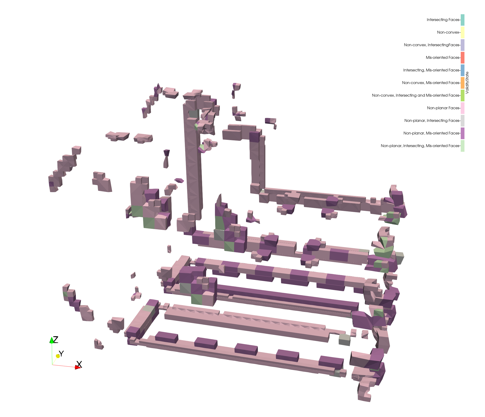

## Cell status enumeration, vtkPolygon, and vtkPolyhedron

The enumeration of defects detected by the `vtkCellValidator` filter
has been (1) expanded with new values and (2) moved out of that class
and into its own `vtkCellStatus.h` header in `Common/DataModel`
so that `vtkPolygon` and `vtkPolyhedron` can take advantage of it.

Those two classes now report additional defects from methods such
as `vtkPolygon::ComputeNormal()`, `vtkPolygon::IsConvex()`, and
`vtkPolyhedron::IsConvex()`. (The original API is not modified, but
additional overloads are available that will report issues.)

Finally, because non-planar faces may be called out separately
from non-convex faces, both vtkPolyhedron and vtkCellValidator
report status differently. In particular, vtkCellValidator's
output cell-data array (named `ValidityState`) may now take on
additional values as shown in the image above.
