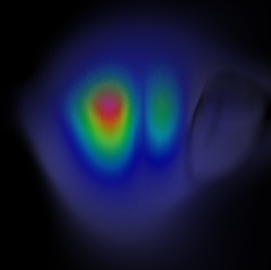

## Non-Uniform Rectilinear Grid Volume Rendering

The GPU based ray-cast volume mapper now supports volume rendering of
non-uniform rectilinear grids. All the features of the volume mapper except
volume streaming (via block partitioning) are supported for rectilinear grids.



### Upgrade notes

`vtkVolumeMapper` and its sub-classes now accept input of type `vtkDataSet` but
ignore all other types except `vtkImageData` and `vtkRectilinearGrid` and their
sub-classes, respectively. This might be considered a breaking change for
consumers that implicitly use the mapper input as `vtkImageData`. Explicit
down-casting to `vtkImageData` would be required in such cases i.e.

```cpp
  vtkImageData* input = vtkImageData::SafeDownCast(mapper->GetInput());
```
