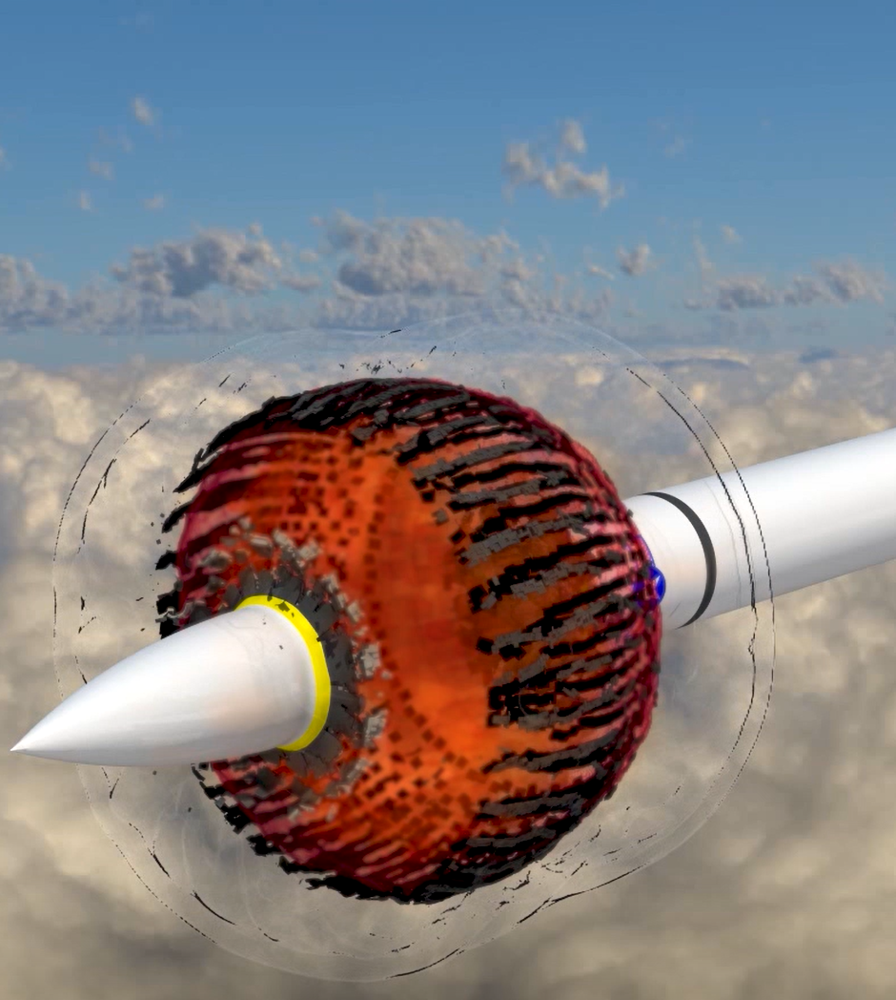

## Added Velodyne AMR Reader

VTK now allows for reading Velodyne AMR data. You
can now read in large (>40GB) AMR datasets to visualize
multiphysics simulations written by Corvid Technologies
code, Velodyne. The image shows a detonation and the corresponding
shockwave that is produced. The Euler Equations are solved within
the AMR framework and output to *.xamr data format on which
this new reader operates

