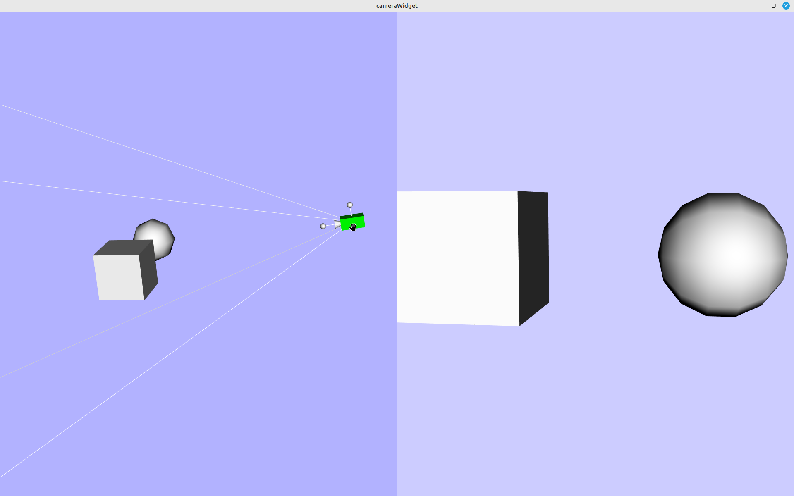

## Add Camera 3D Widget

You can now move and orientate a `vtkCamera` through the widget `vtkCamera3DWidget`
and its representation `vtkCamera3DRepresentation`. For example, if you want to move
the camera of your second point of view (renderer) inside your first one, you can.

The representation allows you to move the camera position, its target position, to
rotate its view up, and to update its view angle. It also has a representation of
the camera frustum.

