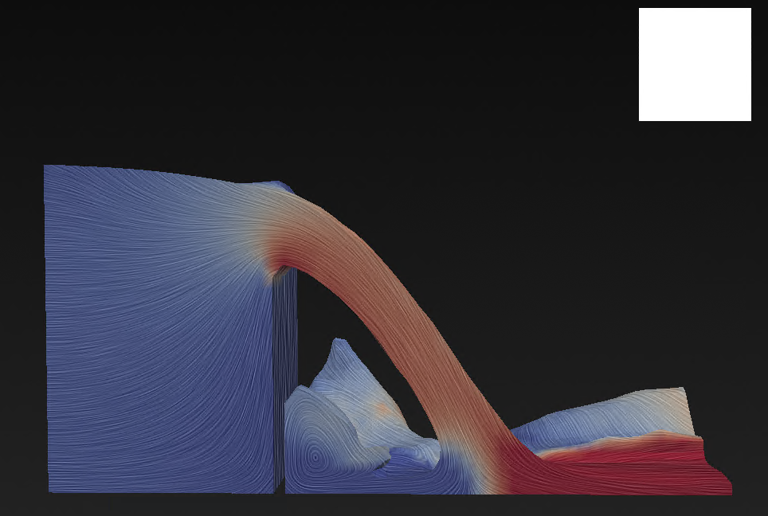
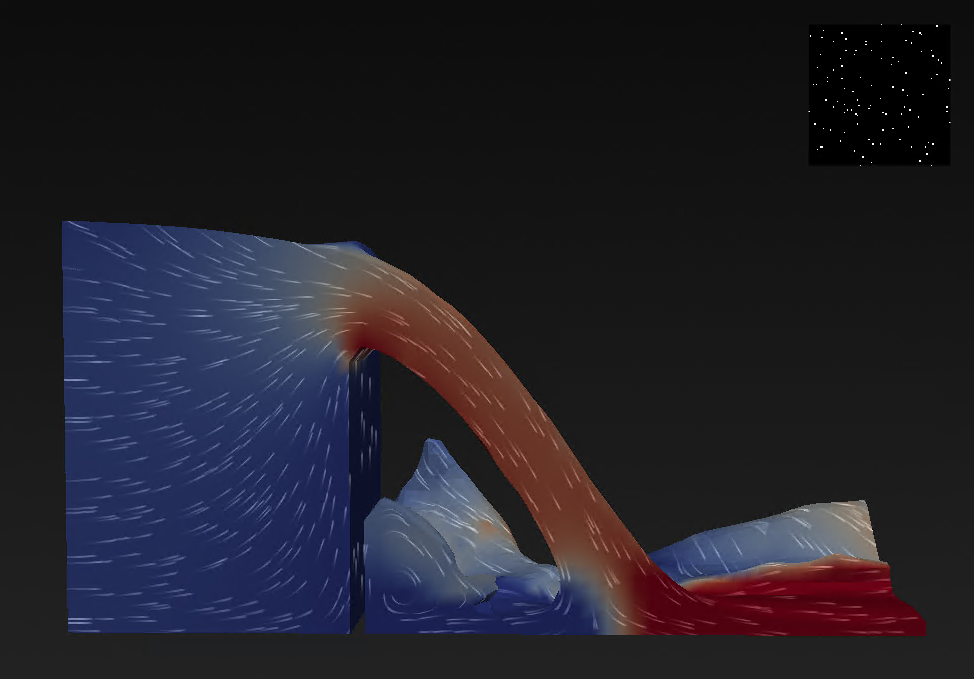

## Surface Line Integral Convolution now supports oriented flow visualization

VTK now provides an oriented mode for
`vtkSurfaceLICInterface` that encodes flow direction in surface LIC visualizations.

Previously, surface LIC produced symmetric streaks that showed flow structure but could not distinguish which way the flow was moving. Oriented LIC produces asymmetric streaks with a visually distinct bright head and fading tail, indicating flow direction on the surface.

OLIC uses a sparse noise texture and an asymettric kernel which have been added in as defaults for the Oriented mode.

