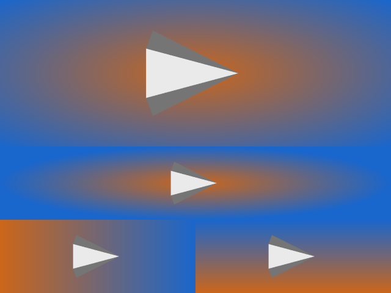

## Add new gradient background modes

You can now use a radial or horizontal gradient background in VTK. The background colors are interpolated smoothly
based on a distance function from the center of the viewport to each pixel in viewport coordinate space.

You can select from various gradient background modes with `vtkViewport::SetGradientMode`. The following modes are available:

1. `VTK_GRADIENT_VERTICAL`
  Background color is used at the bottom, Background2 color is used at the top.
2. `VTK_GRADIENT_HORIZONTAL`
  Background color on the left, Background2 color on the right.
3. `VTK_GRADIENT_RADIAL_VIEWPORT_FARTHEST_SIDE`
  Background color in the center, Background2 color on and beyond the circle/ellipse edge. Circle/Ellipse touches all sides of the square/rectangle viewport.
4. `VTK_GRADIENT_RADIAL_VIEWPORT_FARTHEST_CORNER`
  Background color in the center, Background2 color on and beyond the circle/ellipse edge. Circle/Ellipse touches all corners of the square/rectangle viewport.

