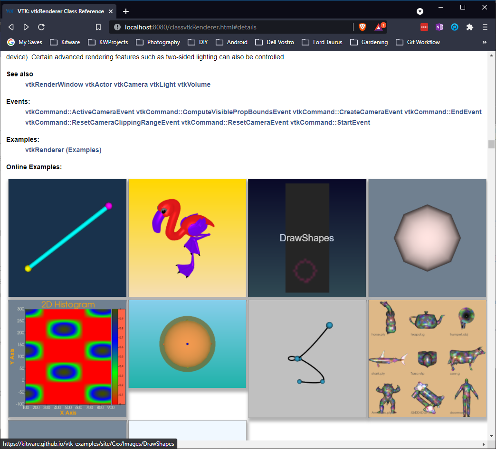

## Cross-reference doxygen documentation with vtk-examples

VTK's doxygen documentation cross-references class pages with the
[vtk-examples](https://kitware.github.io/vtk-examples/site/) website to provide direct links to
examples that use the class. The new vtk_class2onlineexamples.py script also fetches images from the
example pages and displays them on the doc pages.

