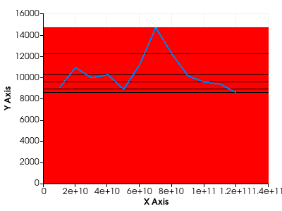

# vtkPlotBar: Account for shift scale in bar width calculation

The bar width calculation in `vtkChartXY::CalculateBarPlots` did not consider
the shift and scale transformations applied to the bar's input data. This
resulted in incorrectly sized bars when a shift or scale was active.

VTK now applies the shift and scale to the x-coordinates before computing the
width, ensuring the bar widths are rendered correctly.

| Before | After |
|:------:|:-----:|
| |  |
