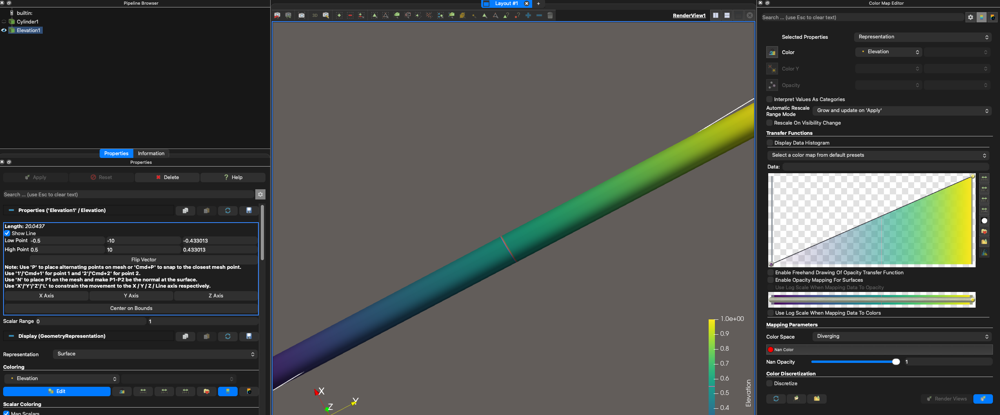

## vtkColorTransferFunction: Consider Hue is circular for diverging interpolation

`vtkColorTransferFunction` has been updated to consider that Hue may be circular when performing diverging
interpolation. This has resolved a bug when trying to utilize the Viridis color map using diverging as color space.

Before:

After:

