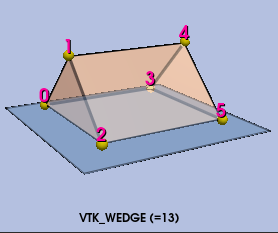

## VTK Wedge Cell Types: Fix Point Ordering, Triangulation and Volume Correctness

This series of commits fixes long-standing issues with wedge cell types in VTK,
where point orderings were inconsistent with parametric coordinates, leading to
incorrect volume computations, negative volume tetrahedra in triangulations, and
faces with incorrect outward normals. The fixes are mentioned below:

1. `vtkWedge`
   - Fix documentation and drawing: the point ordering in the vtk-examples and vtk-book was wrong
     and did not match the cell's parametric coordinates; this has been corrected
     1. Wrong Wedge Point Ordering: 
     2. Corrected Wedge Point Ordering: 
   - Use outward normal winding for each face, which was broken as a result of
     the incorrect point ordering
   - `TriangulateLocalIds` now generates positive volume tetrahedrons
   - Fix tests generating wrong point ordering

2. `vtkQuadraticWedge`
   - Fix documentation and add topology drawing to match parametric coordinates
   - `LinearWedges` now produce positive volume wedges
   - `TriangulateLocalIds` now generates positive volume tetrahedrons
   - Fix mesh with wrong point ordering used by a test

3. `vtkBiQuadraticQuadraticWedge`
   - Add topology drawing
   - `LinearWedges` now produce positive volume wedges
   - `TriangulateLocalIds` now generates tetrahedrons (previously generated linear wedges)

4. `vtkQuadraticLinearWedge`
   - Add topology drawing
   - `LinearWedges` now produce positive volume wedges
   - `TriangulateLocalIds` now generates tetrahedrons (previously generated linear wedges)

5. `vtkHigherOrderWedge`/`vtkBezierWedge`/`vtkLagrangeWedge`
   - Fix documentation to mention that it now shares the same point ordering as `vtkWedge`

6. `vtkBiQuadraticQuadraticHexahedron`
   - `TriangulateLocalIds` now generates tetrahedrons with valid points.

7. `vtkCellTypeSource`
   - Fix `vtkWedge` point ordering to match parametric coordinates
   - Fix `vtkQuadraticWedge` wedge point ordering to match parametric coordinates

8. `vtkEnsigh*Reader`
   - Fix `vtkWedge` point ordering to match parametric coordinates
   - Fix `vtkQuadraticWedge` wedge point ordering to match parametric coordinates

9. `vtkAvmeshReader`
   - Fix `vtkWedge` point ordering to match parametric coordinates

10. `vtkIOSSReader/Writer`
    - Fix `vtkWedge` point ordering to match parametric coordinates
    - Fix `vtkQuadraticWedge` wedge point ordering to match parametric coordinates
    - Fix `vtkBiQuadraticQuadraticWedge` point ordering to match parametric coordinates
    - Fix `vtkLagrangeWedge` point ordering to match parametric coordinates

11. `vtkTRUCHASReader`
    - Fix `vtkWedge` point ordering to match parametric coordinates

12. `vtkMeshQuality`
    - Revert previous `vtkWedge` point ordering fix, superseded by the above changes
    - Fix `vtkQuadraticHexahedron`/`vtkTriQuadraticHexahedron` point ordering to account for differing
      conventions between VTK and Exodus/Patran (used by verdict)
