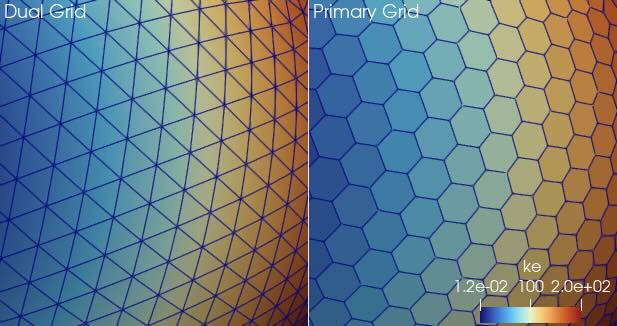

## Read primary grid from MPAS

The `vtkMPASReader` now can read the primary grid from MPAS files. MPAS files
provide the connectivity for two complementary grids. The first "primary" grid
is formed as the Voronoi diagram of points on the globe. It comprises primarily
hexagons and pentagons on the surface. The second "dual" grid is formed as the
Delaunay triangulation of these points on the globe. As the names would imply,
the grids are duals of each other with the cells of the primary corresponding to
points of the dual and vice versa.

Although the simulation operates mostly on the primary grid, `vtkMPASReader`
loaded the dual grid. This is because on the dual grid most results data are on
the points so they get interpolated well and when in multilayer view the surface
triangles are extruded into well supported wedge shapes.

However, scientists sometimes need to see the primary grid. The shape of the
original cells can be important and the data values can get "smeared." Thus,
`vtkMPASReader` now has a `UsePrimaryGrid` option that allows users to see the
original primary grid. Multilayers are also supported by extruding general
polygons into polyhedra cell types.

That said, loading the dual grid (`UsePrimaryGrid` off) is still the default,
which maintains backward compatibility with the previous behavior. The
identification of fields as either point or cell is still based on the dual
grid. This is a little confusing as when turning on the primary grid selected
point fields show up as cell fields.
