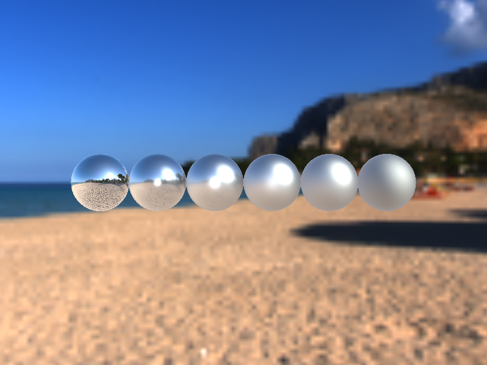

## Multiple Scattering Approximation for Image-Based Lighting

VTK's PBR renderer now applies a multiple scattering energy-compensation
approximation when using image-based lighting (IBL). Previously, high-roughness
metallic surfaces appeared artificially dark because single-scattering models
lose energy at each bounce. The new approximation redistributes that lost
energy, keeping surfaces physically plausible across the full roughness range.

| Single Scattering IBL | Multiple Scattering IBL |
|-----------------------|-------------------------|
|  |  |

In the single-scattering case, increasing roughness causes metallic spheres to
grow progressively darker — an energy-conservation artifact rather than a
physically correct result. With the multiple scattering approximation enabled,
roughness affects only the distribution of highlights; the overall brightness
of the surface is preserved across all roughness values.

The new `TestPBRMultipleScatteringIBL` rendering test verifies this behavior by
rendering six fully metallic spheres with roughness values ranging from `0.0`
to `1.0` under an HDR environment texture. The above images show the results
with single-scattering (left) and multiple-scattering (right) IBL, clearly
demonstrating the improvement in visual fidelity.
