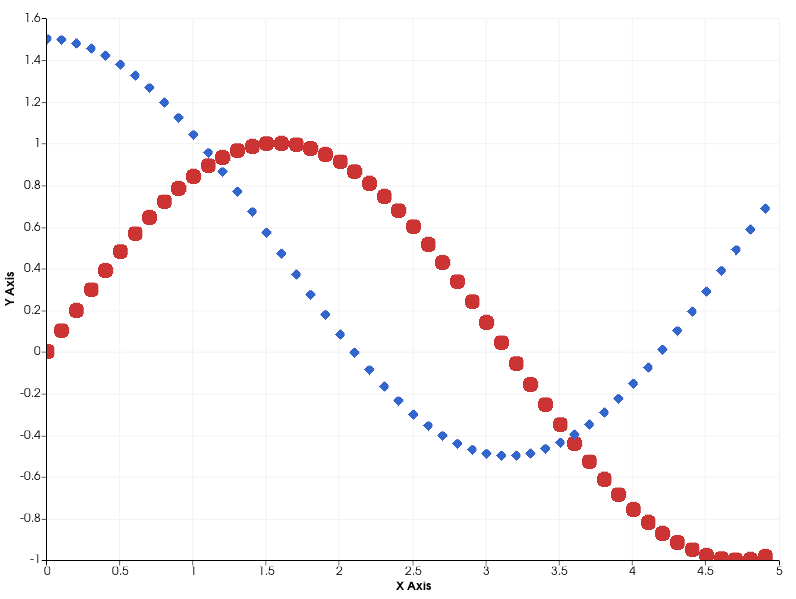
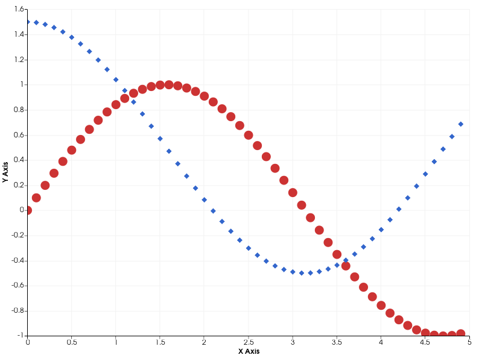

## Antialiased marker sprites in `vtkOpenGLContextDevice2D`

`vtkOpenGLContextDevice2D` now supports antialiased rendering of marker sprites using signed-distance-field (SDF) generation with supersampling and linear texture filtering. This produces smooth, clean edges for non-rectangular marker shapes (circle, diamond, cross, and plus).




`SmoothMarkers` is **disabled** by default. You can enable it by calling `SmoothMarkersOn()` or `SetSmoothMarkers(true)` on a `vtkOpenGLContextDevice2D` instance:

```cpp
device->SmoothMarkersOn();
```

Enabling `SmoothMarkers` requires additional memory and generation time for each cached marker sprite because its texture is supersampled. This overhead is limited to the marker sprites rather than scaling with the size or complexity of the rendered scene. Square markers (`VTK_MARKER_SQUARE`) are not affected and always use the faster rendering path.
