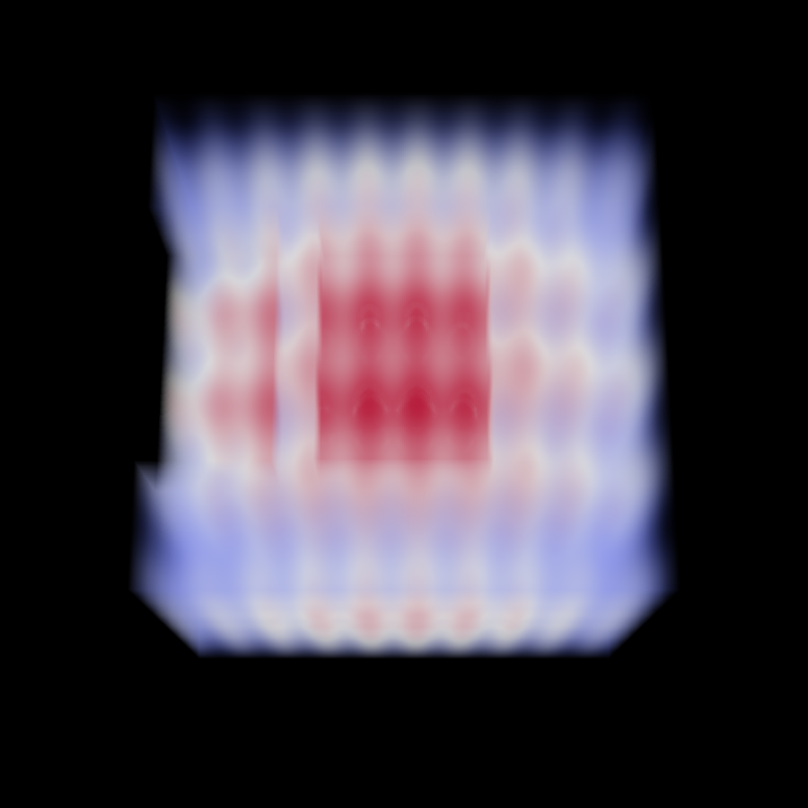
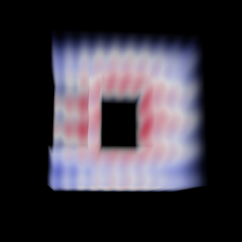

# Volume rendering ghost arrays support

The GPU based ray-cast volume mapper now supports direct volume rendering with blanking of cells and
points defined by individual ghost arrays. It also supports the uniform grid blanking
infrastructure. This means that if the input provided to the volume mapper has
ghost cells/points, the respective cells will be blanked.

## Uniform grid with blanking

## Image data with ghost cells/points

